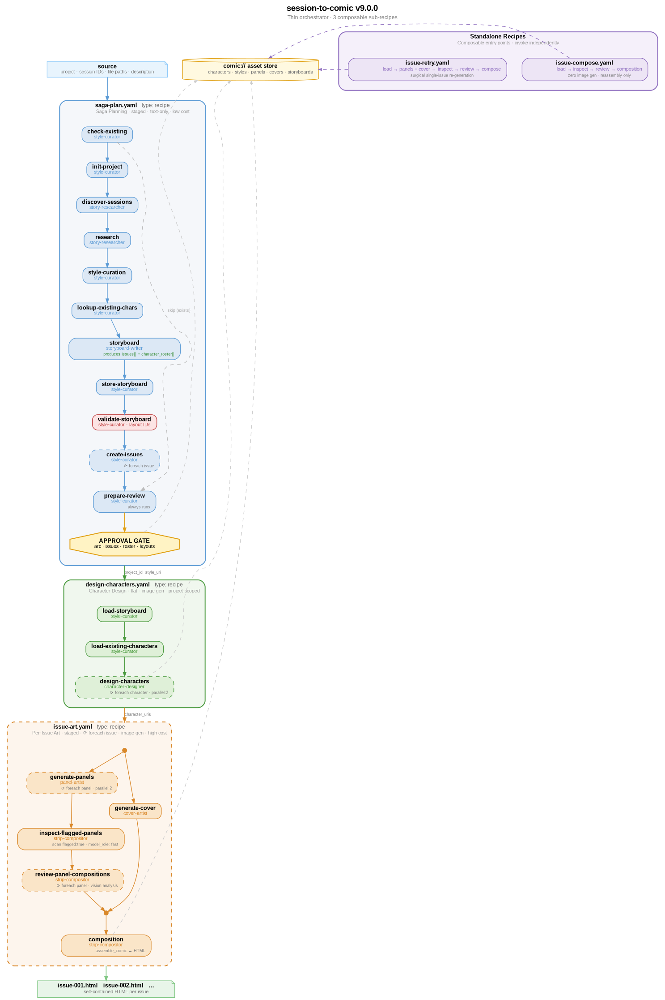

# amplifier-bundle-comic-strips

Transform Amplifier sessions into AI-generated multi-page comic strips with consistent characters, dramatic storytelling, and AmpliVerse publisher branding.

## Prerequisites

- [Amplifier CLI](https://github.com/microsoft/amplifier) installed
- At least one image-capable provider mounted in your Amplifier configuration:
  - **OpenAI** (`provider-openai`) -- uses `gpt-image-1` for image generation
  - **Google Gemini** (`provider-gemini`) -- uses Gemini generateContent or Imagen models

The bundle **does not declare its own providers**. It discovers whatever providers
your Amplifier instance has mounted at runtime. If no mounted providers are found,
it falls back to `OPENAI_API_KEY` / `GOOGLE_API_KEY` environment variables.

Having **both** providers configured gives the best results -- the model selector
picks the optimal model per task and falls back across providers on moderation
blocks or failures.

## Installation

```bash
# Add and activate for current project
amplifier bundle add git+https://github.com/colombod/amplifier-bundle-comic-strips@main
amplifier bundle use comic-strips

# Or install globally so it's always available across all sessions
amplifier bundle add git+https://github.com/colombod/amplifier-bundle-comic-strips@main --app
```

## Quick Start

Generate a comic from an Amplifier session:

```bash
# Using the session-to-comic recipe (CLI)
amplifier tool invoke recipes \
  operation=execute \
  recipe_path=comic-strips:recipes/session-to-comic.yaml \
  context='{"session_file": "path/to/events.jsonl", "style": "sin-city"}'

# Or conversationally in a session
amplifier run "execute session-to-comic with session_file=./my-session.jsonl style=manga"

# Or just talk naturally
amplifier run "Turn my last session into a Sin City noir comic strip"
```

The recipe pauses at an approval gate after the storyboard. Review the character
cast and narrative arc, then approve to proceed with image generation.

## Interactive Modes

The bundle includes five interactive modes that guide comic creation through a structured workflow. Use modes when you want collaborative, step-by-step control over the pipeline. Use direct recipe invocation (`session-to-comic`) when you want fully automated end-to-end generation.

| Mode | Description | `comic_create` | Transitions to |
|------|-------------|:---:|----------------|
| `/comic-brainstorm` | Project vision: style, issue count, narrative scope, character roster | blocked | design |
| `/comic-design` | Interactive character and storyboard work | blocked | plan |
| `/comic-plan` | Layout strategy, generation budgets, kick off pipeline | available | review |
| `/comic-review` | Inspect results, surgical retries | available (delegate: warn) | publish |
| `/comic-publish` | Final QA, ship it | available | -- (exit) |

All transitions require double-confirmation. `allow_clear: true` only on `/comic-publish` (the only exit point). `default_action: block` on all modes.

See `docs/diagrams/mode-transitions.dot` for the full state machine.

## How Model Selection Works

The bundle uses two complementary systems to pick the right model for every task
in the pipeline: Amplifier's **routing matrix** for text/vision agents, and an
internal **model capability registry** for image generation.

### Routing Matrix -- Agents Pick Their Own Model Role

Every agent in the bundle declares a `model_role` in its frontmatter -- an
ordered fallback chain that tells Amplifier's
[routing matrix](https://github.com/microsoft/amplifier-bundle-routing-matrix)
what kind of model the agent needs. The routing matrix resolves the role to the
best available model from the user's configured providers.

| Agent | `model_role` | Why |
|-------|-------------|-----|
| `style-curator` | `[creative, general]` | Aesthetic judgment -- interprets style packs into visual direction |
| `storyboard-writer` | `[creative, general]` | Narrative design -- selects characters, writes dramatic panel sequences |
| `character-designer` | `[creative, general]` | Prompt composition -- crafts detailed character reference prompts |
| `panel-artist` | `[image-gen, vision, creative, general]` | Needs image generation + vision for self-review of generated panels |
| `cover-artist` | `[image-gen, vision, creative, general]` | Same as panel-artist -- generates cover then reviews it |
| `strip-compositor` | `[vision, creative, general]` | Vision for panel composition analysis; no image generation needed |

The fallback chains mean the bundle works across different matrix configurations.
A `[image-gen, vision, creative, general]` chain tries `image-gen` first (models
tuned for visual creation), falls back to `vision` (multimodal models), then
`creative`, then `general`.

**`model_role: fast` for mechanical steps** -- Seven mechanical steps in
`saga-plan.yaml` (check-existing, init-project, discover-sessions,
lookup-existing-chars, store-storyboard, create-issues, prepare-review) plus
`inspect-flagged-panels` in `issue-art.yaml` use `model_role: fast` to route
to cheaper, faster models. These steps perform structured lookups and data
plumbing with no creative judgment required.

**Text-only agents** (`style-curator`, `storyboard-writer`, `character-designer`)
get routed to creative-tier models (e.g. Claude Opus, GPT-5) for high-quality
narrative and aesthetic output. **Visual agents** (`panel-artist`, `cover-artist`)
get routed to image-capable models. **The compositor** gets a vision model because
it analyzes generated panel images to determine speech bubble placement and
layout, but never generates images itself.

### Model Capability Registry -- Image Generation

Image generation uses a separate model selection system inside the
`tool-comic-image-gen` bridge module. This is necessary because image generation
models have capabilities that go beyond what the routing matrix tracks --
reference image support, composition strength, style category coverage, and
moderation behavior all vary per model.

The bridge maintains a **12-model capability registry** across two providers:

**OpenAI models** (via `images.generate` / `images.edit`):

| Model | Reference Images | Composition | Cost |
|-------|:---:|---|---|
| `gpt-image-1.5` | up to 16 | excellent | $$$$$ |
| `gpt-image-1` | up to 16 | good | $$$$ |
| `gpt-image-1-mini` | up to 16 | fair | $$$ |
| `dall-e-3` | -- | fair | $$$ |
| `dall-e-2` | 1 (via edit) | poor | $$ |

**Gemini generateContent models** (LLM-backed, support reference images):

| Model | Reference Images | Composition | Cost |
|-------|:---:|---|---|
| `gemini-3-pro-image-preview` | up to 10 | excellent | $$$$ |
| `gemini-3.1-flash-image-preview` | up to 10 | good | $$$ |
| `gemini-2.5-flash-image` | up to 10 | fair | $$ |
| `gemini-2.0-flash` | up to 10 | poor | $$ |

**Imagen models** (pure diffusion, text-to-image only, no reference images):

| Model | Reference Images | Composition | Cost |
|-------|:---:|---|---|
| `imagen-4.0-ultra-generate-001` | -- | fair | $$$$ |
| `imagen-4.0-generate-001` | -- | fair | $$ |
| `imagen-4.0-fast-generate-001` | -- | poor | $ |

### Selection Algorithm

The `select_model()` function picks the best model for each image given:

1. **Available providers** -- only models from discovered backends are considered
2. **Reference images needed?** -- character reference sheets require edit-capable
   models; filters out DALL-E 3 and all Imagen models
3. **Style category** -- some models only support `"photorealistic"` or
   `"illustration"`, not `"comic"`
4. **Detail level** -- ranks models by output quality tier
5. **Task hint** -- `"composition"` biases toward models with strong spatial
   reasoning (multi-character scenes, panel framing, negative space)
6. **Cost optimization** -- among equally capable models, picks the cheapest

This means: character reference sheets (which need reference images for
consistency) automatically route to `gpt-image-1` or Gemini generateContent
models. Cover art (which needs strong composition) routes to
`gemini-3-pro-image-preview` or `gpt-image-1`. Simple panels may use cheaper
models.

### Composition Strength Ratings

The `composition_strength` field -- which drives cover art and complex scene
selection -- is informed by the
[StrongDM AI Weather Report](https://weatherreport.strongdm.com) "UX Ideation"
benchmarks (Feb 2026). That report tested image models specifically on
compositional layout tasks: multi-element scenes, negative space planning,
character placement, and panel framing.

Its top pick was `gemini-3-pro-image-preview` (internally called "Nano Banana
Pro"), which the registry rates `composition_strength="excellent"`. When
`task_hint="composition"` is passed (used for covers and complex multi-character
panels), the selector biases toward models with high composition strength
regardless of cost.

### Cross-Provider Fallback

When a model is selected by the algorithm (not explicitly overridden), the bridge
uses **soft targeting**: it tries the preferred backend first, but falls back to
other discovered providers on failure. This is particularly useful for moderation
-- if OpenAI blocks a prompt for content policy reasons, the same prompt is
automatically retried on Gemini, which may accept it. If all providers hit
moderation, the bridge returns structured guidance for the agent to rewrite the
scene description.

## Style Gallery

29 predefined visual styles, plus custom descriptions:

| Style | Aesthetic |
|-------|-----------|
| **manga** | Japanese B&W ink wash, speed lines, expressive characters, right-to-left flow |
| **superhero** | Bold saturated colors, dynamic poses, dramatic perspective, cel-shading |
| **sin-city** | Frank Miller noir: extreme B&W contrast, bold silhouettes, selective color splashes, rain-soaked |
| **watchmen** | Muted secondary palette, rigid 3x3 grid, clinical linework, no sound effects |
| **indie** | Gritty painterly aesthetic, dark atmosphere, irregular borders, muted palette |
| **newspaper** | Clean line art, horizontal strip format, punchline pacing, daily-strip feel |
| **ligne-claire** | European clear-line (Tintin/Herge), flat bright colors, detailed backgrounds |
| **retro-americana** | Vintage halftone dots, warm palette, cheerful proportions, 1950s aesthetic |
| **berserk** | Monochrome Gothic hatching, grotesque detail, dark fantasy |
| **charles-addams** | Macabre New Yorker single-panel cartoon, elegant ink wash, Gothic Victorian, deadpan sophistication |
| **cuphead** | 1930s rubber-hose animation, watercolor backgrounds, vintage film grain |
| **ghibli** | Watercolor washes, earthy natural palette, magical realism, gentle forms |
| **attack-on-titan** | Gritty cross-hatching, extreme scale contrast, raw emotional intensity |
| **spider-man** | Dynamic perspective, halftone dots, red/blue web-slinger aesthetic |
| **x-men** | Jim Lee 90s, hyper-detailed crosshatching, bold team colors |
| **solo-leveling** | Dark atmospheric, supernatural energy bursts, sharp digital linework |
| **gundam** | Hard sci-fi mechanical precision, military color-blocking |
| **transformers** | Metallic rendering, faction colors, energon highlights |
| **tatsunoko** | Bold cel-shaded primaries, retro 70s anime warmth |
| **witchblade** | Nocturnal midnight palette, organic curves, dark action |
| **dylan-dog** | Strict B&W monochrome, rigid Bonelli 3-strip grid, crosshatch tonal |
| **tex-willer** | Western frontier ink-wash, earth-tone landscape panels |
| **disney-classic** | Round fluid forms, bright saturated primaries, expressive squash-and-stretch |
| **bendy** | 1930s horror cartoon, ink splatter, sepia-to-black palette |
| **hellraiser** | Body-horror precision, clinical blue-steel palette, visceral detail |
| **naruto** | Warm earthy tones, fisheye lens, feudal Japanese architecture |
| **jujutsu-kaisen** | Oppressive indigo palette, aggressive cross-hatching, inverted speech bubbles |
| **one-piece** | Vibrant saturated adventure colors, wildly exaggerated proportions |
| **go-nagai** | Stark high-contrast B&W with blood crimson, psychedelic swirl patterns |

Custom styles are also supported -- describe any aesthetic and the style-curator
agent will interpret it into a full style guide.

## Recipe Parameters

### session-to-comic

End-to-end pipeline: research, storyboard, character design, panel art, cover, composition.

| Parameter | Required | Default | Description |
|-----------|----------|---------|-------------|
| `session_file` | Yes | -- | Path to `events.jsonl` or session ID |
| `style` | No | `"superhero"` | Style name from gallery above, or any custom description |
| `output_name` | No | `comic-{timestamp}` | Output HTML filename |
| `project_name` | No | `"comic-project"` | Project name for asset tracking |
| `issue_title` | No | from research | Issue title |
| `max_characters` | No | `5-6` | Max characters to design (4-5 main + 1-2 supporting) |
| `max_pages` | No | `5` | Max story pages per issue (plus cover + cast page) |
| `panels_per_page` | No | `"3-6"` | Panels per page range. Pages with 2 panels allowed for dramatic moments |
| `saga_issue` | No | -- | Saga issue number (2, 3, ...) for multi-issue stories |
| `previous_issue_id` | No | -- | Previous issue ID for saga continuity |

**Examples:**

```bash
# Default settings
context='{"session_file": "events.jsonl", "style": "manga"}'

# Epic saga with big cast
context='{"session_file": "events.jsonl", "style": "x-men", "max_characters": "8", "max_pages": "7"}'

# Cinematic with dramatic full-spread pages
context='{"session_file": "events.jsonl", "style": "watchmen", "panels_per_page": "2-4"}'

# Dense action manga
context='{"session_file": "events.jsonl", "style": "naruto", "panels_per_page": "4-6", "max_pages": "6"}'
```

## Pipeline

The `session-to-comic` recipe is a thin orchestrator that calls 3 composable
sub-recipes in sequence. Each sub-recipe is independently invocable.

**Sub-recipe 1 -- `saga-plan.yaml`** (text-only, low cost):

1. **check-existing** -- Skips if storyboard already exists (unless `force=true`)
2. **init-project** -- Creates project and issue with generation metadata
3. **discover-sessions** -- Resolves flexible `source` input to session data
4. **research** -- Analyzes session via `stories:story-researcher`, stores as asset
5. **style-curation** -- Loads or generates style guide, stores as asset
6. **lookup-existing-chars** -- Searches for reusable characters across projects
7. **storyboard** -- Produces multi-issue saga plan with panel sequences, characters, dialogue, camera angles
8. **store-storyboard** / **validate-storyboard** -- Persists and validates layout IDs
9. **create-issues** -- Creates issue assets for each saga issue (foreach)
10. **prepare-review** -- Builds approval summary (always runs)

> **Approval gate** -- Review saga arc, all issues, character roster, and layout validation before committing to image generation

**Sub-recipe 2 -- `design-characters.yaml`** (image generation, project-scoped):

11. **load-storyboard** / **load-existing-characters** -- Loads from asset store
12. **design-characters** -- Generates reference sheets (foreach character, parallel:2)

**Sub-recipe 3 -- `issue-art.yaml`** (foreach issue, image generation, high cost):

13. **generate-panels** -- Panel images with self-review (foreach panel, parallel:2)
14. **generate-cover** -- Cover with AmpliVerse branding (runs in parallel with panels)
15. **inspect-flagged-panels** -- Scans panel results for `flagged:true`, surfaces warnings (model_role: fast)
16. **review-panel-compositions** -- Vision pre-analysis for text overlay placement (foreach panel)
17. **composition** -- Assembles final HTML with SVG speech bubbles, panel shapes, visual QA

**Standalone recipes** (invoke independently for recovery/editing):

- **`issue-compose.yaml`** -- Reassembles HTML from existing assets with zero image generation (includes inspect-flagged-panels and review-panel-compositions steps aligned with the primary path)
- **`issue-retry.yaml`** -- Surgical single-issue re-generation from existing storyboard and characters (includes inspect-flagged-panels and review-panel-compositions steps aligned with the primary path)

## Output Format

Each comic is a **single self-contained HTML file**:

- All images base64-embedded (works offline, no external dependencies)
- Consistent 2:3 aspect ratio pages (comic book proportions)
- 100% page coverage -- panels fill edge-to-edge with 3px gutters
- Panel clip-path shapes for visual variety (diagonal, wedge, bleed, irregular, etc.)
- SVG speech/thought/caption bubbles overlaid on panels
- Keyboard, touch, and click navigation between pages
- Cover with full-bleed image, overlaid title, and AmpliVerse branding
- Cast page with character portraits, roles, and backstory narratives

Open in any browser. No server needed.

## Agent Reference

| Agent | Role | Model Role |
|-------|------|------------|
| `style-curator` | Defines visual style from predefined pack or custom description | `creative` |
| `storyboard-writer` | Selects characters, creates dramatized panel sequence with backstories | `creative` |
| `character-designer` | Generates character reference sheets for visual consistency | `creative` |
| `panel-artist` | Generates panel images with vision-based self-review (max 3 attempts) | `image-gen > vision > creative` |
| `cover-artist` | Generates cover with AmpliVerse branding and self-review | `image-gen > vision > creative` |
| `strip-compositor` | Assembles multi-page HTML with panel shapes, speech bubbles, visual QA | `vision > creative` |

## Module Reference

| Module | Purpose |
|--------|---------|
| `tool-comic-assets` | Project/issue/character/style asset management with `comic://` URI protocol |
| `tool-comic-create` | High-level comic creation: image generation, storage, review, HTML assembly |
| `tool-comic-image-gen` | Image generation bridge with 12-model capability registry and cross-provider fallback (temporary -- see Issue #90) |

## Examples

See [`examples/`](examples/) for generated comics with full pipeline documentation:

**Single-issue examples (v7.4.0--v7.6.0):**

- **Sin City** noir (Frank Miller aesthetic, 10 panels)
- **Jujutsu Kaisen** manga (Gege Akutami style, 19 panels, 3 pages)
- **Watchmen** (rigid grid, muted palette, clinical linework, 14 panels, 4 pages)
- **Studio Ghibli** watercolor (Miyazaki illustration, 34 panels, 10 pages)
- **Naruto** manga (Kishimoto style, 9 panels, 3 pages -- first layout-validation e2e)

**Multi-issue saga example (v9.0.0):**

- **Transformers: The Forge Saga** -- 3-issue saga in Transformers mecha style, 24 panels across 9 story pages. Chronicles the creation of the comic engine itself: genesis, the moderation wall crisis, and the monolith shattering into composable architecture. Demonstrates the v9.0.0 composable sub-recipe pipeline with deterministic panel review, cast page auto-population, and speech bubble auto-layout.

The README there includes the exact prompts that created each one.

## Dependencies

- **amplifier-bundle-stories** -- Session analysis and narrative creation
- **amplifier-bundle-browser-tester** -- Visual QA during composition

Both are automatically included when the bundle is installed.

## Known Issues

- **[Issue #90](https://github.com/microsoft-amplifier/amplifier-support/issues/90)**: Bridge tool module required until Amplifier providers support image output natively. The `tool-comic-image-gen` module is a temporary workaround that calls provider image APIs directly. When the kernel gains native image generation support, this module will be removed and the bundle will use mounted providers through the standard tool interface.

## Diagrams

### Pipeline Orchestration



### Additional Diagrams

- `docs/diagrams/mode-transitions.dot` -- Interactive mode state machine (brainstorm -> design -> plan -> review -> publish)
- `docs/diagrams/per-mode-actions.dot` -- Tool and recipe availability per mode
- `docs/diagrams/two-track-composition.dot` -- Parallel panel + cover generation tracks
- `docs/diagrams/recipe-quality-hardening.dot` -- Quality fixes: inspect-flagged-panels, character self-review, content_policy_notes accumulation
