# v8.0.0 Saga System Implementation Plan

> **Execution:** Use the subagent-driven-development workflow to implement this plan.

**Goal:** Transform the `session-to-comic` recipe from a single-issue pipeline into a multi-issue saga system — one run discovers all material, plans a multi-issue narrative arc, designs characters once across all issues, and generates separate HTML files per issue with shared characters, visual evolution, and narrative continuity.

**Architecture:** The recipe is restructured into 3 stages: Stage 1 (saga planning — text-only, cheap), Stage 2 (character design — image gen, shared across saga), Stage 3 (per-issue art generation via `issue-art.yaml` sub-recipe). A new `search` action on `comic_character` enables cross-project character discovery. A standalone `issue-retry.yaml` recipe provides surgical retry for failed issues.

**Tech Stack:** YAML recipes (Amplifier recipe engine v1.3.0), Python async service (tool-comic-assets), Markdown agent instructions, GraphViz diagrams, pytest with async fixtures.

**Design document:** `docs/plans/2026-03-06-saga-system-design.md`

---

## Notation

- **CWD** = `/home/dicolomb/comic-strip-bundle/amplifier-bundle-comic-strips/` (all paths relative to this)
- **TDD** = write failing test → run → implement → run → commit
- **WVC** = write → validate → commit (for YAML recipes and markdown)

---

## Group A: Tool Module — Cross-Project Character Search (TDD)

### Task 1: Add `search_characters` method to service.py

**Files:**
- Test: `modules/tool-comic-assets/tests/test_search.py` (create)
- Modify: `modules/tool-comic-assets/amplifier_module_comic_assets/service.py`

**Step 1: Write the failing tests**

Create `modules/tool-comic-assets/tests/test_search.py`:

```python
"""Tests for cross-project character search in ComicProjectService."""

from __future__ import annotations

import pytest

from amplifier_module_comic_assets.service import ComicProjectService

# ---------------------------------------------------------------------------
# Shared helpers
# ---------------------------------------------------------------------------

_PNG = b"\x89PNG\r\n\x1a\n" + b"\x00" * 100

_CHAR_META = dict(
    role="protagonist",
    character_type="main",
    bundle="foundation",
    visual_traits="tall, blue eyes",
    team_markers="hero badge",
    distinctive_features="scar on left cheek",
)


async def _new_issue(
    service: ComicProjectService, project: str = "test_project", title: str = "Issue 1"
):
    """Create a project + issue, return (project_id, issue_id)."""
    r = await service.create_issue(project, title)
    return r["project_id"], r["issue_id"]


# ===========================================================================
# search_characters
# ===========================================================================


@pytest.mark.asyncio(loop_scope="function")
async def test_search_characters_finds_across_projects(
    service: ComicProjectService,
) -> None:
    """Characters stored in different projects are discoverable via search."""
    pid1, iid1 = await _new_issue(service, "project_alpha", "Issue 1")
    pid2, iid2 = await _new_issue(service, "project_beta", "Issue 1")

    await service.store_character(
        pid1, iid1, "The Explorer", "manga", **_CHAR_META, data=_PNG,
    )
    await service.store_character(
        pid2, iid2, "The Architect", "manga", **_CHAR_META, data=_PNG,
    )

    results = await service.search_characters(style="manga")
    names = {r["name"] for r in results}
    assert "The Explorer" in names
    assert "The Architect" in names
    assert len(results) == 2


@pytest.mark.asyncio(loop_scope="function")
async def test_search_characters_filters_by_style(
    service: ComicProjectService,
) -> None:
    """Only characters with a matching style variant are returned."""
    pid, iid = await _new_issue(service, "style_test", "Issue 1")

    await service.store_character(
        pid, iid, "The Explorer", "manga", **_CHAR_META, data=_PNG,
    )
    await service.store_character(
        pid, iid, "The Builder", "superhero", **_CHAR_META, data=_PNG,
    )

    results = await service.search_characters(style="manga")
    names = {r["name"] for r in results}
    assert "The Explorer" in names
    assert "The Builder" not in names


@pytest.mark.asyncio(loop_scope="function")
async def test_search_characters_filters_by_metadata(
    service: ComicProjectService,
) -> None:
    """metadata_filter narrows results to characters with matching metadata keys."""
    pid, iid = await _new_issue(service, "meta_test", "Issue 1")

    await service.store_character(
        pid, iid, "The Explorer", "manga", **_CHAR_META, data=_PNG,
        metadata={"agent_id": "foundation:explorer"},
    )
    await service.store_character(
        pid, iid, "The Architect", "manga", **_CHAR_META, data=_PNG,
        metadata={"agent_id": "foundation:zen-architect"},
    )

    results = await service.search_characters(
        style="manga", metadata_filter={"agent_id": "foundation:explorer"},
    )
    assert len(results) == 1
    assert results[0]["name"] == "The Explorer"


@pytest.mark.asyncio(loop_scope="function")
async def test_search_characters_empty_results(
    service: ComicProjectService,
) -> None:
    """Search with no matching characters returns an empty list."""
    results = await service.search_characters(style="nonexistent-style")
    assert results == []


@pytest.mark.asyncio(loop_scope="function")
async def test_search_characters_single_project_filter(
    service: ComicProjectService,
) -> None:
    """project_id parameter restricts search to a single project."""
    pid1, iid1 = await _new_issue(service, "proj_one", "Issue 1")
    pid2, iid2 = await _new_issue(service, "proj_two", "Issue 1")

    await service.store_character(
        pid1, iid1, "The Explorer", "manga", **_CHAR_META, data=_PNG,
    )
    await service.store_character(
        pid2, iid2, "The Architect", "manga", **_CHAR_META, data=_PNG,
    )

    results = await service.search_characters(style="manga", project_id=pid1)
    assert len(results) == 1
    assert results[0]["name"] == "The Explorer"


@pytest.mark.asyncio(loop_scope="function")
async def test_search_characters_returns_uri_and_traits(
    service: ComicProjectService,
) -> None:
    """Each result includes uri, visual_traits, metadata, and originating_project."""
    pid, iid = await _new_issue(service, "uri_test", "Issue 1")
    await service.store_character(
        pid, iid, "The Explorer", "manga", **_CHAR_META, data=_PNG,
        metadata={"agent_id": "foundation:explorer"},
    )

    results = await service.search_characters(style="manga")
    assert len(results) == 1
    result = results[0]
    assert "uri" in result
    assert "comic://" in result["uri"]
    assert result["visual_traits"] == "tall, blue eyes"
    assert result["originating_project"] == pid
    assert result["metadata"]["agent_id"] == "foundation:explorer"
```

**Step 2: Run tests to verify they fail**

```bash
cd modules/tool-comic-assets && uv run pytest tests/test_search.py -v
```

Expected: FAIL — `ComicProjectService` has no `search_characters` method.

**Step 3: Implement `search_characters` in service.py**

Open `modules/tool-comic-assets/amplifier_module_comic_assets/service.py`. Add the following method to the `ComicProjectService` class, after the `update_character_metadata` method (after line 701) and before the `# Assets` comment block (line 703):

```python
    async def search_characters(
        self,
        *,
        style: str | None = None,
        metadata_filter: dict[str, Any] | None = None,
        project_id: str | None = None,
    ) -> list[dict[str, Any]]:
        """Search for characters across all projects (or a single project).

        Walks all ``projects/*/characters/`` directories, reads each
        character's metadata, and filters by style and optional metadata
        fields.  Returns a list of matches with URIs, visual traits,
        metadata, and originating project.

        Parameters
        ----------
        style : str, optional
            If provided, only return characters that have a variant in
            this style.
        metadata_filter : dict, optional
            If provided, only return characters whose ``metadata`` dict
            contains all specified key/value pairs.
        project_id : str, optional
            If provided, restrict search to this single project.
        """
        workspace = await self._read_workspace()
        project_ids: list[str] = (
            [project_id] if project_id else workspace.get("projects", [])
        )

        style_slug = slugify(style) if style else None
        results: list[dict[str, Any]] = []

        for pid in project_ids:
            try:
                project_manifest = await self._read_project_manifest(pid)
            except FileNotFoundError:
                continue

            char_slugs: list[str] = project_manifest.get("characters", [])
            for char_slug in char_slugs:
                char_base_dir = f"projects/{pid}/characters/{char_slug}"
                try:
                    dirs = await self._storage.list_dir(char_base_dir)
                except FileNotFoundError:
                    continue

                # Find version dirs matching the requested style.
                candidate_dirs: list[str] = []
                if style_slug:
                    prefix = f"{style_slug}_v"
                    candidate_dirs = [
                        d for d in dirs
                        if d.startswith(prefix) and d[len(prefix):].isdigit()
                    ]
                    if not candidate_dirs:
                        continue
                else:
                    candidate_dirs = dirs

                if not candidate_dirs:
                    continue

                # Pick the latest version dir.
                best_dir: str | None = None
                best_version = 0
                for d in candidate_dirs:
                    idx = d.rfind("_v")
                    if idx == -1:
                        continue
                    ver_part = d[idx + 2:]
                    if ver_part.isdigit() and int(ver_part) > best_version:
                        best_version = int(ver_part)
                        best_dir = d

                if best_dir is None:
                    continue

                try:
                    meta_text = await self._storage.read_text(
                        f"{char_base_dir}/{best_dir}/metadata.json"
                    )
                    meta = json.loads(meta_text)
                except (FileNotFoundError, json.JSONDecodeError):
                    continue

                # Apply metadata_filter.
                if metadata_filter:
                    char_meta = meta.get("metadata", {})
                    if not all(
                        char_meta.get(k) == v
                        for k, v in metadata_filter.items()
                    ):
                        continue

                uri = str(
                    ComicURI.for_character(pid, char_slug, version=best_version)
                )
                results.append({
                    "name": meta.get("name", char_slug),
                    "char_slug": char_slug,
                    "style": meta.get("style", ""),
                    "version": best_version,
                    "visual_traits": meta.get("visual_traits", ""),
                    "distinctive_features": meta.get("distinctive_features", ""),
                    "metadata": meta.get("metadata", {}),
                    "originating_project": pid,
                    "uri": uri,
                })

        return results
```

**Step 4: Run tests to verify they pass**

```bash
cd modules/tool-comic-assets && uv run pytest tests/test_search.py -v
```

Expected: All 6 tests PASS.

**Step 5: Commit**

```bash
cd /home/dicolomb/comic-strip-bundle/amplifier-bundle-comic-strips
git add modules/tool-comic-assets/amplifier_module_comic_assets/service.py modules/tool-comic-assets/tests/test_search.py
git commit -m "feat(assets): add search_characters method for cross-project discovery"
```

---

### Task 2: Wire up `search` action in ComicCharacterTool

**Files:**
- Modify: `modules/tool-comic-assets/amplifier_module_comic_assets/__init__.py`
- Test: `modules/tool-comic-assets/tests/test_search.py` (append)

**Step 1: Write the failing test**

Append to `modules/tool-comic-assets/tests/test_search.py`:

```python
# ===========================================================================
# ComicCharacterTool search action (integration)
# ===========================================================================

from amplifier_module_comic_assets import ComicCharacterTool


@pytest.mark.asyncio(loop_scope="function")
async def test_character_tool_search_action(
    service: ComicProjectService,
) -> None:
    """The comic_character tool dispatches 'search' action correctly."""
    pid, iid = await _new_issue(service, "tool_search_proj", "Issue 1")
    await service.store_character(
        pid, iid, "The Explorer", "manga", **_CHAR_META, data=_PNG,
        metadata={"agent_id": "foundation:explorer"},
    )

    tool = ComicCharacterTool(service)
    result = await tool.execute({"action": "search", "style": "manga"})
    assert result.success is True

    import json
    data = json.loads(result.output)
    assert len(data) == 1
    assert data[0]["name"] == "The Explorer"


@pytest.mark.asyncio(loop_scope="function")
async def test_character_tool_search_with_metadata_filter(
    service: ComicProjectService,
) -> None:
    """The 'search' action passes metadata_filter through to the service."""
    pid, iid = await _new_issue(service, "tool_meta_proj", "Issue 1")
    await service.store_character(
        pid, iid, "The Explorer", "manga", **_CHAR_META, data=_PNG,
        metadata={"agent_id": "foundation:explorer"},
    )
    await service.store_character(
        pid, iid, "The Architect", "manga", **_CHAR_META, data=_PNG,
        metadata={"agent_id": "foundation:zen-architect"},
    )

    tool = ComicCharacterTool(service)
    result = await tool.execute({
        "action": "search",
        "style": "manga",
        "metadata_filter": {"agent_id": "foundation:explorer"},
    })
    assert result.success is True

    import json
    data = json.loads(result.output)
    assert len(data) == 1
    assert data[0]["name"] == "The Explorer"
```

**Step 2: Run tests to verify they fail**

```bash
cd modules/tool-comic-assets && uv run pytest tests/test_search.py::test_character_tool_search_action -v
```

Expected: FAIL — `Unknown action 'search'`.

**Step 3: Wire up the `search` action**

In `modules/tool-comic-assets/amplifier_module_comic_assets/__init__.py`, make two changes:

**Change 1:** Add `"search"` to the `ComicCharacterTool.input_schema` enum list (around line 341). Find the `"enum"` list inside the `action` property:

```python
                    "enum": [
                        "store",
                        "get",
                        "list",
                        "list_versions",
                        "update_metadata",
                    ],
```

Change it to:

```python
                    "enum": [
                        "store",
                        "get",
                        "list",
                        "list_versions",
                        "update_metadata",
                        "search",
                    ],
```

**Change 2:** Also add `"metadata_filter"` to the `input_schema` `properties` dict. Add this after the `"metadata"` property (around line 439):

```python
                "metadata_filter": {
                    "type": "object",
                    "description": (
                        "Filter characters by metadata key/value pairs (for search). "
                        "Example: {\"agent_id\": \"foundation:explorer\"}"
                    ),
                },
```

**Change 3:** Add the `_search` handler inside `ComicCharacterTool.execute()`. Find the `dispatch` dict (around line 568) and add the handler before it:

```python
        async def _search() -> ToolResult:
            try:
                result = await self._service.search_characters(
                    style=params.get("style"),
                    metadata_filter=params.get("metadata_filter"),
                    project_id=params.get("project"),
                )
                return _ok(result)
            except (ValueError, FileNotFoundError) as exc:
                return _exc_error(exc)

        dispatch: dict[str, Any] = {
            "store": _store,
            "get": _get,
            "list": _list,
            "list_versions": _list_versions,
            "update_metadata": _update_metadata,
            "search": _search,
        }
```

**Step 4: Run all search tests**

```bash
cd modules/tool-comic-assets && uv run pytest tests/test_search.py -v
```

Expected: All 8 tests PASS.

**Step 5: Run the full test suite to check for regressions**

```bash
cd modules/tool-comic-assets && uv run pytest tests/ -x -v
```

Expected: All existing tests still PASS.

**Step 6: Commit**

```bash
cd /home/dicolomb/comic-strip-bundle/amplifier-bundle-comic-strips
git add modules/tool-comic-assets/amplifier_module_comic_assets/__init__.py modules/tool-comic-assets/tests/test_search.py
git commit -m "feat(assets): wire up 'search' action on comic_character tool"
```

---

## Group B: Sub-Recipes (Write → Validate → Commit)

### Task 3: Create `recipes/issue-art.yaml`

**Files:**
- Create: `recipes/issue-art.yaml`

**Step 1: Write the sub-recipe**

Create `recipes/issue-art.yaml`:

```yaml
name: "issue-art"
description: "Per-issue art generation sub-recipe — panels, cover, and composition for a single saga issue. Invoked by the parent session-to-comic recipe's Stage 3 foreach."
version: "1.0.0"
author: "amplifier-comic-strips"
tags: ["comic", "art-generation", "sub-recipe", "saga"]

# Context variables passed from the parent recipe's foreach step.
# Sub-recipes receive ONLY explicitly passed context (context isolation).
context:
  project_id: ""            # Parent project ID
  issue_id: ""              # This issue's ID (e.g. "issue-002")
  issue_number: ""          # Issue number (e.g. 2)
  issue_storyboard: ""      # This issue's storyboard slice (panel_list, page_layouts, character_list, recap, cliffhanger)
  character_uris: ""        # Map of char_slug to variant URI for THIS issue
  style_uri: ""             # Style URI from parent style curation
  style: ""                 # Style name (e.g. "transformers")
  output_name: ""           # Output filename for this issue
  saga_context: ""          # Previous issue's cliffhanger + recap text for narrative continuity
  content_policy_notes: ""  # Accumulated moderation lessons

steps:
  # ============================================
  # STEP 1: PANEL ART (foreach per panel)
  # ============================================
  - id: "generate-panels"
    foreach: "{{issue_storyboard.panel_list}}"
    as: panel_item
    agent: "comic-strips:panel-artist"
    parallel: 2
    max_iterations: 60
    retry:
      max_attempts: 2
      initial_delay: 5
    prompt: |
      Project tracking: project_id={{project_id}}, issue_id={{issue_id}}, style={{style}}

      Generate the artwork for a single comic panel using comic_create.

      Panel to generate:
      {{panel_item}}

      Character URIs (for visual consistency — pass these directly to comic_create):
      {{character_uris}}

      Style Guide URI: {{style_uri}}
      Load the style guide using: comic_style(action='get', uri='{{style_uri}}')

      Saga context (for narrative continuity):
      {{saga_context}}

      Call:
      comic_create(action='create_panel',
                   project='{{project_id}}',
                   issue='{{issue_id}}',
                   name=<panel-name-slug from panel_item>,
                   prompt=<scene description from panel_item informed by style guide>,
                   character_uris=<list of URIs from {{character_uris}} whose characters appear in this panel>,
                   size=<use panel_item.aspect_ratio if present, otherwise map panel_item.size: wide/standard->landscape, tall->portrait, square->square>,
                   camera_angle=<framing hint from panel_item>)

      After generating, self-review using:
      comic_create(action='review_asset',
                   uri=<returned panel URI>,
                   prompt="Are faces visible and unobstructed? Is there a clear focal point? Does it tell the story visually? Does it match the style?",
                   reference_uris=<character URIs from character_uris for consistency check>)

      If the review fails (passed=false), regenerate with an adjusted prompt (max 3 attempts).

      Return ONLY the panel URI string from the final successful comic_create response.

      Content Policy Notes:
      {{content_policy_notes}}
      If content_policy_notes is non-empty, apply them to ALL your prompts immediately.
    collect: "panel_results"
    timeout: 600

  # ============================================
  # STEP 2: COVER ART
  # ============================================
  - id: "generate-cover"
    agent: "comic-strips:cover-artist"
    depends_on: []
    retry:
      max_attempts: 2
      initial_delay: 5
    prompt: |
      Project tracking: project_id={{project_id}}, issue_id={{issue_id}}, style={{style}}

      You are generating cover art for issue #{{issue_number}} of a saga using comic_create.

      Style Guide URI: {{style_uri}}
      Load the style guide using: comic_style(action='get', uri='{{style_uri}}')

      Issue storyboard (for cover concept — title, theme, key characters):
      {{issue_storyboard}}

      Character URIs (pass featured characters directly to comic_create):
      {{character_uris}}

      Call:
      comic_create(action='create_cover',
                   project='{{project_id}}',
                   issue='{{issue_id}}',
                   prompt=<dramatic cover concept for this specific issue>,
                   character_uris=<list of featured character URIs>,
                   title='{{issue_storyboard.title}}',
                   subtitle='Issue #{{issue_number}}')

      After generating, self-review using:
      comic_create(action='review_asset',
                   uri=<returned cover URI>,
                   prompt="Are main characters in a dramatic pose with faces visible? Does it match the style?",
                   reference_uris=<character URIs>)

      If the review fails, regenerate (max 3 attempts).

      Return ONLY the cover URI string.

      IMPORTANT: If cover generation fails after all attempts, return "COVER_GENERATION_FAILED".

      Content Policy Notes:
      {{content_policy_notes}}
    output: "cover_results"
    timeout: 600

  # ============================================
  # STEP 3: COMPOSITION
  # ============================================
  - id: "composition"
    agent: "comic-strips:strip-compositor"
    depends_on: ["generate-panels", "generate-cover"]
    prompt: |
      Project tracking: project_id={{project_id}}, issue_id={{issue_id}}, style={{style}}

      Assemble the final comic strip HTML for issue #{{issue_number}} from URIs using comic_create.

      Panel URIs (in order):
      {{panel_results}}

      Cover URI:
      {{cover_results}}

      Issue storyboard (for dialogue, captions, sound effects per panel):
      {{issue_storyboard}}

      Style Guide URI: {{style_uri}}
      Load layout conventions using: comic_style(action='get', uri='{{style_uri}}')

      Output filename: {{output_name}}

      Saga context (for recap and cliffhanger):
      {{saga_context}}
      If saga_context includes a recap, add a "Previously..." recap text block at the start of the first story page.
      If saga_context includes a cliffhanger (and this is not the final issue), add a "To Be Continued..." tease at the end.

      WORKFLOW:
      1. Load the style guide for layout conventions, bubble styles, page structure.
      2. For each panel URI in {{panel_results}}, call:
         comic_create(action='review_asset', uri=<panel_uri>,
                      prompt="Describe character positions, negative space, and focal points for text overlay placement.")
      3. Build a layout object mapping each panel URI to its storyboard dialogue, captions, and sound effects.
      4. Call:
         comic_create(action='assemble_comic',
                      project='{{project_id}}',
                      issue='{{issue_id}}',
                      output_path=<output filename>,
                      style_uri='{{style_uri}}',
                      layout={
                        "title": "{{issue_storyboard.title}}",
                        "cover": {"uri": "{{cover_results}}", "title": "{{issue_storyboard.title}}",
                                  "subtitle": "Issue #{{issue_number}}", "branding": "AmpliVerse"},
                        "pages": [<pages with panel URIs, shapes, and text overlays>]
                      })

      Do NOT delete intermediate files. All assets are managed by the asset manager.

      Content Policy Notes: {{content_policy_notes}}
    output: "final_output"
    timeout: 2400
```

**Step 2: Validate the sub-recipe**

```bash
amplifier tool invoke recipes operation=validate recipe_path=@comic-strips:recipes/issue-art.yaml
```

Expected: Validation PASSED (or warnings about unresolved variables, which is expected since context is passed at runtime).

**Step 3: Commit**

```bash
cd /home/dicolomb/comic-strip-bundle/amplifier-bundle-comic-strips
git add recipes/issue-art.yaml
git commit -m "feat(recipes): add issue-art.yaml sub-recipe for per-issue art generation"
```

---

### Task 4: Create `recipes/issue-retry.yaml`

**Files:**
- Create: `recipes/issue-retry.yaml`

**Step 1: Write the retry recipe**

Create `recipes/issue-retry.yaml`:

```yaml
name: "issue-retry"
description: "Standalone retry recipe for a single failed saga issue. Re-runs panel art, cover art, and HTML composition using existing storyboard and character URIs from the asset store. No re-research, no re-storyboard, no re-character-design."
version: "1.0.0"
author: "amplifier-comic-strips"
tags: ["comic", "retry", "saga", "recovery"]

# Usage:
#   execute issue-retry with project_id=comic-engine-chronicles issue_id=issue-002 style=transformers

context:
  project_id: ""            # Required: existing project ID
  issue_id: ""              # Required: issue ID to retry (e.g. "issue-002")
  style: ""                 # Required: style name (e.g. "transformers")
  output_name: ""           # Optional: custom output filename
  content_policy_notes: ""  # Optional: accumulated moderation lessons

steps:
  # ============================================
  # STEP 0: LOAD EXISTING ASSETS
  # Retrieve storyboard, character URIs, and style URI
  # that were already created in the saga run.
  # ============================================
  - id: "load-existing-assets"
    agent: "comic-strips:style-curator"
    prompt: |
      YOUR ONLY JOB: Load existing assets for issue retry. Do NOTHING else.

      1. Load the storyboard for this issue:
         comic_asset(action='get', project='{{project_id}}', issue='{{issue_id}}', type='storyboard', name='storyboard', include='full')

      2. Load all characters in this project:
         comic_character(action='list', project='{{project_id}}')

      3. Load the style guide:
         comic_style(action='get', project='{{project_id}}', name='{{style}}', include='full')

      Return as JSON:
      {
        "storyboard": <the storyboard content from step 1>,
        "character_uris": <list of character URIs from step 2>,
        "style_uri": <style URI from step 3>,
        "issue_id": "{{issue_id}}",
        "project_id": "{{project_id}}"
      }
    output: "existing_assets"
    parse_json: true
    timeout: 300

  # ============================================
  # STEP 1: PANEL ART (foreach per panel)
  # Same as issue-art.yaml but standalone.
  # ============================================
  - id: "generate-panels"
    foreach: "{{existing_assets.storyboard.panel_list}}"
    as: panel_item
    agent: "comic-strips:panel-artist"
    parallel: 2
    max_iterations: 60
    retry:
      max_attempts: 2
      initial_delay: 5
    prompt: |
      Project tracking: project_id={{project_id}}, issue_id={{issue_id}}, style={{style}}

      Generate the artwork for a single comic panel using comic_create.

      Panel to generate:
      {{panel_item}}

      Character URIs (from existing project roster):
      {{existing_assets.character_uris}}

      Style Guide URI: {{existing_assets.style_uri}}
      Load the style guide using: comic_style(action='get', uri='{{existing_assets.style_uri}}')

      Call comic_create(action='create_panel', ...) as normal.
      Return ONLY the panel URI string.

      Content Policy Notes:
      {{content_policy_notes}}
    collect: "panel_results"
    timeout: 600

  # ============================================
  # STEP 2: COVER ART
  # ============================================
  - id: "generate-cover"
    agent: "comic-strips:cover-artist"
    depends_on: []
    retry:
      max_attempts: 2
      initial_delay: 5
    prompt: |
      Project tracking: project_id={{project_id}}, issue_id={{issue_id}}, style={{style}}

      Generate cover art for this issue retry using comic_create.

      Style Guide URI: {{existing_assets.style_uri}}
      Storyboard: {{existing_assets.storyboard}}
      Character URIs: {{existing_assets.character_uris}}

      Call comic_create(action='create_cover', ...) as normal.
      Return ONLY the cover URI string, or "COVER_GENERATION_FAILED" on failure.

      Content Policy Notes:
      {{content_policy_notes}}
    output: "cover_results"
    timeout: 600

  # ============================================
  # STEP 3: COMPOSITION
  # ============================================
  - id: "composition"
    agent: "comic-strips:strip-compositor"
    depends_on: ["generate-panels", "generate-cover"]
    prompt: |
      Project tracking: project_id={{project_id}}, issue_id={{issue_id}}, style={{style}}

      Assemble the final comic strip HTML from URIs using comic_create.

      Panel URIs: {{panel_results}}
      Cover URI: {{cover_results}}
      Storyboard: {{existing_assets.storyboard}}
      Style Guide URI: {{existing_assets.style_uri}}
      Output filename: {{output_name}}

      Call comic_create(action='assemble_comic', ...) as normal.
      Do NOT delete intermediate files.

      Content Policy Notes: {{content_policy_notes}}
    output: "final_output"
    timeout: 2400
```

**Step 2: Validate**

```bash
amplifier tool invoke recipes operation=validate recipe_path=@comic-strips:recipes/issue-retry.yaml
```

Expected: Validation PASSED.

**Step 3: Commit**

```bash
cd /home/dicolomb/comic-strip-bundle/amplifier-bundle-comic-strips
git add recipes/issue-retry.yaml
git commit -m "feat(recipes): add issue-retry.yaml for surgical single-issue retry"
```

---

## Group C: Main Recipe Restructure (Sequential, each step builds on prior)

### Task 5: Update context block — add `max_issues`

**Files:**
- Modify: `recipes/session-to-comic.yaml`

**Step 1: Add `max_issues` to the context block**

In `recipes/session-to-comic.yaml`, find the context block (line 259). Add `max_issues` after the `panels_per_page` line (line 270):

Find:
```yaml
  panels_per_page: ""     # Optional: panels per page range (default "3-6"). Use "2-4" for cinematic, "4-6" for dense.
```

After it, add:
```yaml
  max_issues: "5"         # Optional: max issues in a saga (default 5). Controls how many issues the saga planner creates.
```

**Step 2: Commit**

```bash
cd /home/dicolomb/comic-strip-bundle/amplifier-bundle-comic-strips
git add recipes/session-to-comic.yaml
git commit -m "feat(recipe): add max_issues context variable (default 5)"
```

---

### Task 6: Restructure init-project step — project-only creation

**Files:**
- Modify: `recipes/session-to-comic.yaml`

**Step 1: Rewrite the init-project step**

The current init-project step (lines 287-300) creates both a project AND an issue. For the saga system, it should create ONLY the project. Issues are created later in Step 3b after the saga planner determines how many are needed.

Find the init-project step prompt (lines 289-297) and replace it:

Find:
```yaml
      - id: "init-project"
        agent: "comic-strips:style-curator"
        prompt: |
          YOUR ONLY JOB: Call comic_project to create an issue, then return the result as JSON. Do NOTHING else.

          comic_project(action='create_issue', project='{{project_name}}', title='{{issue_title}}', metadata={"source": "{{source}}", "session_file": "{{session_file}}", "style": "{{style}}", "created_by": "session-to-comic recipe v7.7.0", "saga_issue": "{{saga_issue}}", "previous_issue_id": "{{previous_issue_id}}"})

          If project_name is empty, use "comic-project". If issue_title is empty, use "Comic Strip".

          Return ONLY the JSON from the tool response: {"project_id": "<value>", "issue_id": "<value>"}
          Do NOT read files, do NOT curate styles, do NOT do anything else. Just call the tool and return.
        output: "project_init"
        parse_json: true
        timeout: 120  # init-project: single tool call + return
```

Replace with:
```yaml
      - id: "init-project"
        agent: "comic-strips:style-curator"
        prompt: |
          YOUR ONLY JOB: Create a project and a placeholder first issue, then return the result as JSON. Do NOTHING else.

          comic_project(action='create_issue', project='{{project_name}}', title='{{issue_title}}', metadata={"source": "{{source}}", "session_file": "{{session_file}}", "style": "{{style}}", "created_by": "session-to-comic recipe v8.0.0", "max_issues": "{{max_issues}}"})

          If project_name is empty, use "comic-project". If issue_title is empty, use "Saga Planning".

          Return ONLY the JSON from the tool response: {"project_id": "<value>", "issue_id": "<value>"}
          Do NOT read files, do NOT curate styles, do NOT do anything else. Just call the tool and return.
        output: "project_init"
        parse_json: true
        timeout: 120
```

**Step 2: Update discover-sessions to suggest a project name**

Find the discover-sessions prompt (lines 312-339). Add smart project naming instructions. After the line `DO NOT extract comic-specific structures...` and before the `Store the consolidated research...` line, add:

Find:
```yaml
          DO NOT extract comic-specific structures (characters, panel moments, narrative arcs).
          That is the research step's job. You are purely "find the data and consolidate it."

          Store the consolidated research material using:
```

Replace with:
```yaml
          DO NOT extract comic-specific structures (characters, panel moments, narrative arcs).
          That is the research step's job. You are purely "find the data and consolidate it."

          SMART PROJECT NAMING: If "{{project_name}}" is empty or "comic-project", propose a meaningful
          project name based on what you discovered. For example, if you're researching a comic-strip-bundle
          project, suggest "comic-engine-chronicles" or "forging-the-comic-engine". Include the suggestion
          in the stored data under a "suggested_project_name" field.

          Store the consolidated research material using:
```

**Step 3: Commit**

```bash
cd /home/dicolomb/comic-strip-bundle/amplifier-bundle-comic-strips
git add recipes/session-to-comic.yaml
git commit -m "feat(recipe): restructure init-project for saga, add smart project naming"
```

---

### Task 7: Rewrite Step 3 — saga storyboard

**Files:**
- Modify: `recipes/session-to-comic.yaml`

**Step 1: Replace the storyboard step prompt**

Find the storyboard step (starting at line 423, `- id: "storyboard"`). Replace the entire prompt (from `prompt: |` through the end of the prompt text, just before `output: "storyboard"`):

Find the existing prompt starting with:
```yaml
      - id: "storyboard"
        agent: "comic-strips:storyboard-writer"
        prompt: |
          Create a panel-by-panel storyboard for this comic strip.
```

Replace the entire step with:
```yaml
      - id: "storyboard"
        agent: "comic-strips:storyboard-writer"
        prompt: |
          Create a SAGA STORYBOARD for a multi-issue comic series.

          Research Data URI: {{research_data}}
          Load the research data:
          comic_asset(action='get', uri='{{research_data}}', include='full')

          Style Guide URI: {{style_guide}}
          Load the style guide content using: comic_style(action='get', uri='{{style_guide}}')

          IMPORTANT: You are a TWO-PHASE agent producing a SAGA PLAN.

          **Phase 1 — Delegate Narrative Creation:**
          First, delegate to stories:content-strategist with the research data to select
          the best narrative arc. Then delegate to stories:case-study-writer with the arc
          and research data to generate Challenge → Approach → Results narrative prose.

          **Story Hints from User (apply these throughout):**
          {{story_hints}}

          **Phase 2 — Translate to Multi-Issue Saga:**
          Take the narrative prose and plan a MULTI-ISSUE saga.

          **SAGA BUDGET:**
          - Max issues: {{max_issues}} (default: 5 if empty)
          - Max characters: {{max_characters}} (default: 5-6 if empty)
          - Story pages per issue: {{max_pages}} (default: 5 if empty)
          - Panels per page: {{panels_per_page}} (default: 3-6 if empty)

          **SAGA PLANNING RULES:**
          1. Divide the narrative into issue-sized arcs. Each issue has its own mini-arc.
          2. Issue 1 covers the Challenge and early Approach.
          3. Later issues continue the Approach and deliver Results.
          4. Each issue (except the last) ends with a cliffhanger.
          5. Each issue (except the first) starts with a recap of the previous issue.
          6. ALL issues share a character roster — characters are designed ONCE for the saga.
          7. Characters can EVOLVE across issues (costume changes, damage, power-ups).

          **CROSS-PROJECT CHARACTER DISCOVERY:**
          Before selecting characters, search for existing ones across all projects:
          comic_character(action='search', style='{{style}}')
          If matches are found, set existing_uri on the roster entry.

          **SMART PROJECT NAMING:**
          If "{{project_name}}" is empty or "comic-project", propose a meaningful project
          name in the output JSON under "suggested_project_name" based on the narrative.

          **MANDATORY: Call comic_create(action='list_layouts') BEFORE selecting page layouts.**

          CRITICAL OUTPUT: Your JSON output MUST follow the saga storyboard structure:
          {
            "title": "Saga Title",
            "subtitle": "Short tagline",
            "suggested_project_name": "meaningful-project-id",
            "saga_plan": {
              "total_issues": N,
              "arc_summary": "...",
              "issues": [
                {
                  "issue_number": 1,
                  "title": "Issue Title",
                  "character_list": ["char_slug_1", "char_slug_2"],
                  "panel_list": [...],
                  "page_layouts": [...],
                  "page_count": N,
                  "panel_count": N,
                  "cliffhanger": "...",
                  "recap": null
                },
                ...
              ]
            },
            "character_roster": [
              {
                "name": "The Architect",
                "char_slug": "the_architect",
                "role": "protagonist",
                "type": "main",
                "bundle": "foundation",
                "first_appearance": 1,
                "existing_uri": null,
                "needs_redesign": false,
                "visual_traits": "...",
                "description": "...",
                "backstory": "...",
                "metadata": {"agent_id": "foundation:zen-architect"},
                "per_issue": {
                  "1": null,
                  "2": {"evolution": "battle-worn armor", "needs_new_variant": true},
                  "3": {"evolution": "fully restored, golden trim", "needs_new_variant": true}
                }
              },
              ...
            ]
          }

          The saga_plan.issues[] array drives downstream foreach loops.
          The character_roster[] drives character design in Stage 2.

          Project tracking: project_id={{project_init.project_id}}, issue_id={{project_init.issue_id}}
          After producing the saga storyboard JSON, store it:
          comic_asset(action='store', project='{{project_init.project_id}}', issue='{{project_init.issue_id}}', type='storyboard', name='storyboard', content=<your saga storyboard JSON>)
        output: "storyboard"
        parse_json: true
        timeout: 1800
```

**Step 2: Commit**

```bash
cd /home/dicolomb/comic-strip-bundle/amplifier-bundle-comic-strips
git add recipes/session-to-comic.yaml
git commit -m "feat(recipe): rewrite storyboard step for saga planning"
```

---

### Task 8: Update validate-storyboard for all issues

**Files:**
- Modify: `recipes/session-to-comic.yaml`

**Step 1: Update the validate-storyboard prompt**

Find the validate-storyboard step (starting around line 504). Update the prompt to validate layouts across ALL issues:

Replace the existing validate-storyboard step with:

```yaml
      - id: "validate-storyboard"
        agent: "comic-strips:style-curator"
        prompt: |
          YOUR ONLY JOB: Validate the storyboard page layouts across ALL saga issues. Do NOTHING else.

          Saga plan issues:
          {{storyboard.saga_plan.issues}}

          For EACH issue in the saga plan, extract its page_layouts array and validate ALL of them.
          Call: comic_create(action='validate_storyboard', page_layouts=<combined page_layouts from all issues>)

          If validation PASSED for all issues, return ONLY:
          {"validation": "PASSED", "total_issues": <count>, "total_pages": <sum of page counts>}

          If validation FAILED for any issue, return:
          {"validation": "FAILED", "invalid_layout_ids": <from tool>, "suggestions": <from tool>, "failed_issues": <list of issue numbers with invalid layouts>}
        output: "storyboard_validation"
        parse_json: true
        timeout: 120
```

**Step 2: Commit**

```bash
cd /home/dicolomb/comic-strip-bundle/amplifier-bundle-comic-strips
git add recipes/session-to-comic.yaml
git commit -m "feat(recipe): validate-storyboard checks layouts across ALL saga issues"
```

---

### Task 9: Add Step 3b — issue creation foreach

**Files:**
- Modify: `recipes/session-to-comic.yaml`

**Step 1: Replace the update-issue-title step with issue creation foreach**

Find the current `update-issue-title` step (around line 524). Replace it entirely with the issue creation foreach:

Replace:
```yaml
      - id: "update-issue-title"
        agent: "comic-strips:style-curator"
        prompt: |
          YOUR ONLY JOB: Update the issue title to match the storyboard title. Do NOTHING else.

          comic_project(action='update_issue', project='{{project_init.project_id}}', issue='{{project_init.issue_id}}', title='{{storyboard.title}}')

          Return ONLY: {"updated": true, "title": "{{storyboard.title}}"}
        output: "issue_title_update"
        parse_json: true
        timeout: 60
```

With:
```yaml
      # ============================================
      # STEP 3b: CREATE ISSUES (foreach over saga plan)
      # Creates issue-001, issue-002, etc. for each
      # planned saga issue.
      # ============================================
      - id: "create-issues"
        foreach: "{{storyboard.saga_plan.issues}}"
        as: saga_issue
        agent: "comic-strips:style-curator"
        max_iterations: 20
        prompt: |
          YOUR ONLY JOB: Create (or update) an issue for this saga entry. Do NOTHING else.

          Issue number: {{saga_issue.issue_number}}
          Issue title: {{saga_issue.title}}
          Project: {{project_init.project_id}}

          If this is issue #1, update the existing issue (created during init):
          comic_project(action='update_issue', project='{{project_init.project_id}}', issue='{{project_init.issue_id}}', title='{{saga_issue.title}}', metadata={"saga_issue": "{{saga_issue.issue_number}}", "saga_title": "{{storyboard.title}}"})
          Return: {"issue_id": "{{project_init.issue_id}}", "issue_number": {{saga_issue.issue_number}}, "title": "{{saga_issue.title}}"}

          If this is issue #2 or later, create a new issue:
          comic_project(action='create_issue', project='{{project_init.project_id}}', title='{{saga_issue.title}}', metadata={"saga_issue": "{{saga_issue.issue_number}}", "saga_title": "{{storyboard.title}}", "style": "{{style}}", "created_by": "session-to-comic recipe v8.0.0"})
          Return the JSON from the tool response: {"issue_id": "<value>", "issue_number": {{saga_issue.issue_number}}, "title": "{{saga_issue.title}}"}
        collect: "saga_issues"
        timeout: 120
```

**Step 2: Commit**

```bash
cd /home/dicolomb/comic-strip-bundle/amplifier-bundle-comic-strips
git add recipes/session-to-comic.yaml
git commit -m "feat(recipe): add create-issues foreach step for saga issue creation"
```

---

### Task 10: Update approval gate for full saga summary

**Files:**
- Modify: `recipes/session-to-comic.yaml`

**Step 1: Replace the approval gate prompt**

Find the approval section (around line 543). Replace the approval prompt with a saga-aware version:

Replace the approval `prompt:` content with:

```yaml
    approval:
      required: true
      prompt: |
        SAGA STORYBOARD COMPLETE. Review before approving expensive image generation.

        Saga Title: {{storyboard.title}}
        Subtitle: {{storyboard.subtitle}}
        Total Issues: {{storyboard.saga_plan.total_issues}}
        Arc Summary: {{storyboard.saga_plan.arc_summary}}
        Max Issues Budget: {{max_issues}}

        Layout validation: {{storyboard_validation.validation}}

        Issues planned:
        {{storyboard.saga_plan.issues}}

        Full character roster (shared across all issues):
        {{storyboard.character_roster}}

        Issues created:
        {{saga_issues}}

        If layout validation FAILED, DENY and fix the storyboard layouts.
        Otherwise, approve to proceed with character design and per-issue art generation.
      timeout: 0
      default: "deny"
```

**Step 2: Commit**

```bash
cd /home/dicolomb/comic-strip-bundle/amplifier-bundle-comic-strips
git add recipes/session-to-comic.yaml
git commit -m "feat(recipe): update approval gate for full saga arc summary"
```

---

### Task 11: Add Stage 2 — character design foreach over roster

**Files:**
- Modify: `recipes/session-to-comic.yaml`

**Step 1: Restructure Stage 2**

Find the current Stage 2 section (around line 568, `- name: "art-generation"`). Replace the entire `art-generation` stage with the new Stage 2 (character design) and Stage 3 (per-issue art).

Replace everything from `- name: "art-generation"` through the end of the file (line 799) with:

```yaml
  # ==========================================================================
  # STAGE 2: CHARACTER DESIGN
  # Image generation for character reference sheets. Characters are designed
  # once for the saga and shared across all issues. Per-issue variants are
  # created for characters with evolution notes.
  # ==========================================================================
  - name: "character-design"
    steps:
      # ============================================
      # STEP 4: CHARACTER DESIGN (foreach per character in roster)
      # ============================================
      - id: "design-characters"
        foreach: "{{storyboard.character_roster}}"
        as: character_item
        agent: "comic-strips:character-designer"
        parallel: 2
        max_iterations: 20
        retry:
          max_attempts: 2
          initial_delay: 5
        prompt: |
          Project tracking: project_id={{project_init.project_id}}, style={{style}}

          Create a character reference sheet for this single character using comic_create.
          This character is part of a SAGA — they may appear across multiple issues.

          Character to design:
          {{character_item}}

          Use the FIRST issue's issue_id for storage: {{project_init.issue_id}}

          Style Guide URI: {{style_guide}}
          Load the style guide using: comic_style(action='get', uri='{{style_guide}}')

          Character Hints from User:
          {{character_hints}}

          **CROSS-PROJECT DISCOVERY:**
          If {{character_item}}.existing_uri is set, check if it's reusable:
          - If needs_redesign is false → skip generation, return existing URI
          - If needs_redesign is true → load existing and use as reference base

          **PER-ISSUE VARIANTS:**
          Check {{character_item}}.per_issue for evolution notes.
          For each issue where needs_new_variant is true, create a variant.
          The base design (v1) is for the first appearance.
          Variants (v2, v3, ...) incorporate the evolution description.

          STYLE COHESION (CRITICAL): All characters MUST share the same visual DNA.

          Call comic_create(action='create_character_ref', ...) for each variant needed.

          Return ONLY the character URI string for the base design.
          (Variants are stored automatically — downstream steps resolve per-issue variants.)
        collect: "character_uris"
        timeout: 600

  # ==========================================================================
  # STAGE 3: PER-ISSUE ART GENERATION
  # Invokes issue-art.yaml sub-recipe once per issue. Each invocation
  # generates panels, cover, and HTML for one issue. Uses on_error: continue
  # so a failed issue doesn't block the rest of the saga.
  # ==========================================================================
  - name: "per-issue-art"
    steps:
      # ============================================
      # STEP 5: PER-ISSUE ART (foreach issue → sub-recipe)
      # ============================================
      - id: "generate-issues"
        foreach: "{{storyboard.saga_plan.issues}}"
        as: current_issue
        type: "recipe"
        recipe: "issue-art.yaml"
        on_error: "continue"
        max_iterations: 20
        context:
          project_id: "{{project_init.project_id}}"
          issue_id: "{{current_issue.issue_id}}"
          issue_number: "{{current_issue.issue_number}}"
          issue_storyboard: "{{current_issue}}"
          character_uris: "{{character_uris}}"
          style_uri: "{{style_guide}}"
          style: "{{style}}"
          output_name: "{{output_name}}-issue-{{current_issue.issue_number}}"
          saga_context: "{{current_issue.saga_context}}"
          content_policy_notes: "{{content_policy_notes}}"
        collect: "issue_results"
        timeout: 7200
```

**Step 2: Commit**

```bash
cd /home/dicolomb/comic-strip-bundle/amplifier-bundle-comic-strips
git add recipes/session-to-comic.yaml
git commit -m "feat(recipe): add Stage 2 (character design) and Stage 3 (per-issue art via sub-recipe)"
```

---

### Task 12: Version bump to v8.0.0 + changelog

**Files:**
- Modify: `recipes/session-to-comic.yaml`

**Step 1: Update version**

Find line 3:
```yaml
version: "7.7.0"
```

Replace with:
```yaml
version: "8.0.0"
```

**Step 2: Add changelog entry**

Find the changelog block at the top (after line 8 `# CHANGELOG`). Add the v8.0.0 entry before the existing v7.7.0 entry:

Find:
```yaml
# v7.7.0 (2026-03-06):
```

Insert before it:
```yaml
# v8.0.0 (2026-03-06):
#   - FEAT: Multi-issue saga system. One run discovers all material, plans a
#     multi-issue narrative arc, designs characters once across all issues, and
#     generates separate HTML files per issue with narrative continuity.
#   - FEAT: 3-stage architecture: Stage 1 (saga planning — text-only), Stage 2
#     (character design — shared across saga), Stage 3 (per-issue art via
#     issue-art.yaml sub-recipe).
#   - FEAT: New issue-art.yaml sub-recipe for per-issue panel/cover/composition.
#   - FEAT: New issue-retry.yaml recipe for surgical retry of failed issues.
#   - FEAT: Cross-project character discovery via comic_character(action='search').
#   - FEAT: max_issues context variable (default 5) caps saga planner output.
#   - FEAT: Smart project naming — discover-sessions suggests a project name
#     from source material when project_name is empty.
#   - FEAT: Character evolution across issues — per_issue map with visual
#     overrides and variant creation.
#   - FEAT: Three-level error handling: (1) panel-artist retries on moderation
#     blocks, (2) on_error:continue on Stage 3 foreach skips failed issues,
#     (3) issue-retry.yaml for standalone re-run of failed issues.
#   - CHANGE: init-project creates project + placeholder issue. Saga issues
#     created in Step 3b after storyboard planning.
#   - CHANGE: Storyboard step produces full saga plan with issues[] array,
#     character_roster[] with per_issue evolution, cliffhangers, and recaps.
#   - CHANGE: Character design foreach iterates over character_roster (not
#     per-issue character_list). Characters designed once, variants per issue.
#   - CHANGE: Approval gate shows full saga arc, all issues, character roster.
#   - CHANGE: validate-storyboard checks layouts across ALL saga issues.
#
```

**Step 3: Update the usage comment**

Find the usage comment (around line 254):
```yaml
# Usage:
#   amplifier run "execute session-to-comic with source=comic-strip-bundle style=superhero"
```

Replace with:
```yaml
# Usage:
#   amplifier run "execute session-to-comic with source=comic-strip-bundle style=superhero"
#   amplifier run "execute session-to-comic with source=comic-strip-bundle style=transformers max_issues=3"
#   amplifier run "execute session-to-comic with source=./my-session.jsonl style=manga output_name=my-comic"
#   amplifier run "execute session-to-comic with session_file=./events.jsonl style=naruto"  # (deprecated, still works)
#
# Saga retry (re-run a single failed issue):
#   amplifier run "execute issue-retry with project_id=my-project issue_id=issue-002 style=transformers"
```

**Step 4: Validate the recipe**

```bash
amplifier tool invoke recipes operation=validate recipe_path=@comic-strips:recipes/session-to-comic.yaml
```

Expected: Validation PASSED.

**Step 5: Commit**

```bash
cd /home/dicolomb/comic-strip-bundle/amplifier-bundle-comic-strips
git add recipes/session-to-comic.yaml
git commit -m "feat(recipe): bump to v8.0.0 — multi-issue saga system"
```

---

## Group D: Agent Instructions (Write → Commit)

### Task 13: Update storyboard-writer.md for saga planning

**Files:**
- Modify: `agents/storyboard-writer.md`

**Step 1: Add saga planning section**

Open `agents/storyboard-writer.md`. Make these changes:

**Change 1:** Update the meta description (lines 4-13). Find `description: >` and update it to mention saga planning:

Replace the existing description with:
```yaml
  description: >
    MUST be used to create the panel-by-panel comic storyboard AFTER style-curator completes.
    Two-phase storyboard agent. Phase 1: delegates narrative arc selection to
    stories:content-strategist and prose generation to stories:case-study-writer.
    Phase 2: translates the narrative into a SAGA STORYBOARD — a multi-issue plan
    with per-issue panel breakdown, shared character roster with per-issue evolution,
    cliffhangers, recaps, and smart project naming. Uses cross-project character
    search via comic_character(action='search') to discover reusable characters.
    Respects max_issues budget. Produces saga_plan.issues[] and character_roster[]
    as the canonical data structures that drive downstream stages.
```

**Change 2:** Add a new section "## Saga Planning" after the "## Story Hints" section (after line 64). Insert:

```markdown
---

## Saga Planning (v8.0.0)

When the recipe passes `max_issues` > 1 (default: 5), you produce a **saga storyboard** — a multi-issue plan where one run produces all issues.

### Saga Storyboard Structure

Your output JSON has two scopes:

**Saga-level (shared):**
- `title` — the saga title (e.g., "Forging the Comic Engine")
- `subtitle` — short tagline
- `suggested_project_name` — meaningful project ID if user didn't provide one
- `saga_plan` — arc summary, total issues
- `character_roster[]` — ALL characters across the saga

**Per-issue (scoped):**
- Each `saga_plan.issues[]` entry has its OWN `character_list[]`, `panel_list[]`, `page_layouts[]`, `cliffhanger`, `recap`
- The `character_list` references roster entries by slug

### Cross-Project Character Discovery

Before selecting characters, search for existing ones across all projects:

```
comic_character(action='search', style='{{style}}')
```

If matches are found for a character that maps to the same agent, set `existing_uri` on the roster entry. The character-designer will reuse or redesign as appropriate.

### Smart Project Naming

If `project_name` is empty or "comic-project", propose a meaningful name:
- Derive from the narrative content discovered by the researcher
- Use kebab-case (e.g., "comic-engine-chronicles", "forging-the-comic-engine")
- Include as `suggested_project_name` in the output JSON

### Character Roster with Per-Issue Evolution

Each character in `character_roster[]` has a `per_issue` map:

```json
{
  "name": "The Explorer",
  "char_slug": "the_explorer",
  "per_issue": {
    "1": null,
    "2": {"evolution": "cloak is torn, carries a map", "needs_new_variant": true},
    "3": {"evolution": "fully armored", "needs_new_variant": true}
  }
}
```

The character-designer uses `per_issue` to decide whether to create new variants.

### Issue Planning Rules

1. Each issue has its own mini-arc (setup, tension, resolution or cliffhanger)
2. Issue 1 starts the Challenge — no recap
3. Issues 2+ begin with a recap of the previous issue's cliffhanger
4. All issues except the last end with a cliffhanger
5. Respect `max_issues` — if the story needs more, plan exactly `max_issues` and note what was deferred
6. Each issue's `character_list` contains ONLY the characters appearing in THAT issue
```

**Change 3:** Update the "Step 4a: Saga Assessment" section (around line 155). Replace the existing content with an updated version that references the saga planning rules above and removes the "single issue" fallback language.

**Step 2: Commit**

```bash
cd /home/dicolomb/comic-strip-bundle/amplifier-bundle-comic-strips
git add agents/storyboard-writer.md
git commit -m "feat(agents): update storyboard-writer for saga planning, cross-project search, smart naming"
```

---

### Task 14: Update character-designer.md for per-issue variants

**Files:**
- Modify: `agents/character-designer.md`

**Step 1: Add per-issue variant section**

Open `agents/character-designer.md`. Make these changes:

**Change 1:** Update the meta description (lines 4-12) to mention per-issue variants and cross-project discovery:

Replace the existing description with:
```yaml
  description: >
    MUST be used for ALL character reference sheet generation in the comic pipeline.
    Single-character reference image generator invoked once per character in the
    saga's character_roster[]. Receives ONE character object via {{character_item}}
    from the recipe foreach loop, plus the style guide. Supports three workflows:
    (1) reuse existing character via existing_uri, (2) redesign with style update,
    (3) create new character. NEW in v8.0.0: creates per-issue variants when
    per_issue.needs_new_variant is true. Uses cross-project search for discovery.
```

**Change 2:** Add a new section after "## Process" → "### Step 0" (around line 123). Insert before "### Step 1":

```markdown
### Step 0b: Per-Issue Variant Creation (Saga Mode)

When `{{character_item}}.per_issue` is present, this character may need visual variants for different issues:

1. **First, create the base design** (v1) using the normal Step 1 workflow below.
2. **Then, for each issue** in `per_issue` where `needs_new_variant` is `true`:
   - Read the `evolution` description (e.g., "cloak is torn, carries a map")
   - Use the base design as reference
   - Create a new variant by calling `comic_create(action='create_character_ref')` with:
     - The evolution description incorporated into the prompt
     - The base character's visual traits preserved (silhouette, face, team markers)
     - A clear note: "This is variant v{N} of {character_name} for issue #{issue_number}"
   - The variant is auto-versioned (v2, v3, ...) by the asset manager

**Example:** If The Explorer has `per_issue: {"1": null, "2": {"evolution": "cloak torn", "needs_new_variant": true}}`:
- v1 = base design (for issue 1)
- v2 = torn cloak variant (for issue 2)

### Step 0c: Cross-Project Discovery

If `{{character_item}}.existing_uri` contains a cross-project URI (from a different project), retrieve the character to use as a visual reference base:

```
comic_character(action='get', uri='{{character_item}}.existing_uri', include='full')
```

Use the retrieved `visual_traits` and `distinctive_features` to maintain visual continuity across projects while adapting to the current style.
```

**Step 2: Commit**

```bash
cd /home/dicolomb/comic-strip-bundle/amplifier-bundle-comic-strips
git add agents/character-designer.md
git commit -m "feat(agents): update character-designer for per-issue variants and cross-project discovery"
```

---

## Group E: Documentation

### Task 15: Redraw pipeline-flow.dot for 3-stage saga architecture

**Files:**
- Modify: `docs/diagrams/pipeline-flow.dot`

**Step 1: Rewrite the diagram**

Replace the entire contents of `docs/diagrams/pipeline-flow.dot` with:

```dot
digraph pipeline {
  // Global settings
  rankdir=TB;
  bgcolor="transparent";
  fontname="Helvetica Neue,Helvetica,Arial,sans-serif";
  node [fontname="Helvetica Neue,Helvetica,Arial,sans-serif", fontsize=11];
  edge [fontname="Helvetica Neue,Helvetica,Arial,sans-serif", fontsize=9];
  newrank=true;
  compound=true;
  splines=ortho;
  nodesep=0.5;
  ranksep=0.6;

  // Title
  labelloc="t";
  label=<<B><FONT POINT-SIZE="16">Comic Generation Pipeline v8.0.0 — Saga System</FONT></B>>;
  labeljust="c";

  // Input
  input [
    label=<<TABLE BORDER="0" CELLBORDER="0" CELLSPACING="0">
      <TR><TD><B>{{source}}</B></TD></TR>
      <TR><TD><FONT POINT-SIZE="9" COLOR="#666666">project name, session ID(s),</FONT></TD></TR>
      <TR><TD><FONT POINT-SIZE="9" COLOR="#666666">file path(s), or description</FONT></TD></TR>
      <TR><TD><FONT POINT-SIZE="9" COLOR="#666666">+ max_issues (default 5)</FONT></TD></TR>
    </TABLE>>,
    shape=note, style="filled", fillcolor="#E8F4FD", color="#90CAF9",
    width=2.2
  ];

  // Stage 1 cluster
  subgraph cluster_stage1 {
    label=<<B>Stage 1 — Saga Planning</B><BR/><FONT POINT-SIZE="9" COLOR="#555555">text-only, low cost</FONT>>;
    style="rounded,filled"; fillcolor="#F5F5F5"; color="#BDBDBD";
    fontname="Helvetica Neue,Helvetica,Arial,sans-serif"; fontsize=12;
    margin=16;

    init [
      label=<<TABLE BORDER="0" CELLBORDER="0" CELLSPACING="2">
        <TR><TD><B>0. Init Project</B></TD></TR>
        <TR><TD><FONT POINT-SIZE="9" COLOR="#1565C0">style-curator</FONT></TD></TR>
        <TR><TD><FONT POINT-SIZE="8" COLOR="#666666">project only (no issue yet)</FONT></TD></TR>
      </TABLE>>,
      shape=box, style="rounded,filled", fillcolor="#E3F2FD", color="#90CAF9",
      width=2.2
    ];

    discover_sessions [
      label=<<TABLE BORDER="0" CELLBORDER="0" CELLSPACING="2">
        <TR><TD><B>0a. Discover Sessions</B></TD></TR>
        <TR><TD><FONT POINT-SIZE="9" COLOR="#1565C0">stories:story-researcher</FONT></TD></TR>
        <TR><TD><FONT POINT-SIZE="8" COLOR="#2E7D32">+ smart project naming</FONT></TD></TR>
      </TABLE>>,
      shape=box, style="rounded,filled", fillcolor="#E3F2FD", color="#90CAF9",
      width=2.4
    ];

    research [
      label=<<TABLE BORDER="0" CELLBORDER="0" CELLSPACING="2">
        <TR><TD><B>1. Research</B></TD></TR>
        <TR><TD><FONT POINT-SIZE="9" COLOR="#1565C0">stories:story-researcher</FONT></TD></TR>
      </TABLE>>,
      shape=box, style="rounded,filled", fillcolor="#E3F2FD", color="#90CAF9",
      width=2.2
    ];

    style_curation [
      label=<<TABLE BORDER="0" CELLBORDER="0" CELLSPACING="2">
        <TR><TD><B>2. Style Curation</B></TD></TR>
        <TR><TD><FONT POINT-SIZE="9" COLOR="#1565C0">style-curator</FONT></TD></TR>
      </TABLE>>,
      shape=box, style="rounded,filled", fillcolor="#E3F2FD", color="#90CAF9",
      width=2.2
    ];

    storyboard [
      label=<<TABLE BORDER="0" CELLBORDER="0" CELLSPACING="2">
        <TR><TD><B>3. Saga Storyboard</B></TD></TR>
        <TR><TD><FONT POINT-SIZE="9" COLOR="#1565C0">storyboard-writer</FONT></TD></TR>
        <TR><TD><FONT POINT-SIZE="8" COLOR="#2E7D32">issues[] + character_roster[]</FONT></TD></TR>
        <TR><TD><FONT POINT-SIZE="8" COLOR="#2E7D32">cross-project character search</FONT></TD></TR>
        <TR><TD><FONT POINT-SIZE="8" COLOR="#2E7D32">per_issue evolution maps</FONT></TD></TR>
        <TR><TD><FONT POINT-SIZE="8" COLOR="#2E7D32">cliffhangers + recaps</FONT></TD></TR>
      </TABLE>>,
      shape=box, style="rounded,filled", fillcolor="#E3F2FD", color="#90CAF9",
      width=2.8
    ];

    validate_storyboard [
      label=<<TABLE BORDER="0" CELLBORDER="0" CELLSPACING="2">
        <TR><TD><B>3a. Validate Storyboard</B></TD></TR>
        <TR><TD><FONT POINT-SIZE="9" COLOR="#1565C0">style-curator</FONT></TD></TR>
        <TR><TD><FONT POINT-SIZE="8" COLOR="#C62828">validates ALL issues' layouts</FONT></TD></TR>
      </TABLE>>,
      shape=box, style="rounded,filled", fillcolor="#FFEBEE", color="#EF9A9A",
      width=2.6
    ];

    create_issues [
      label=<<TABLE BORDER="0" CELLBORDER="0" CELLSPACING="2">
        <TR><TD><B>3b. Create Issues</B></TD></TR>
        <TR><TD><FONT POINT-SIZE="9" COLOR="#1565C0">style-curator (foreach)</FONT></TD></TR>
        <TR><TD><FONT POINT-SIZE="8" COLOR="#666666">issue-001, issue-002, ...</FONT></TD></TR>
      </TABLE>>,
      shape=box, style="rounded,filled", fillcolor="#E3F2FD", color="#90CAF9",
      width=2.4
    ];

    init -> discover_sessions -> research -> style_curation -> storyboard -> validate_storyboard -> create_issues [color="#90CAF9"];
  }

  // Approval gate
  gate [
    label=<<TABLE BORDER="0" CELLBORDER="0" CELLSPACING="2">
      <TR><TD><B>APPROVAL GATE</B></TD></TR>
      <TR><TD><FONT POINT-SIZE="9">Full saga arc, all issues, roster</FONT></TD></TR>
      <TR><TD><FONT POINT-SIZE="8" COLOR="#C62828">layout validation across ALL issues</FONT></TD></TR>
    </TABLE>>,
    shape=diamond, style="filled", fillcolor="#FFF9C4", color="#F9A825",
    width=3.0, height=1.0
  ];

  // Stage 2 cluster (Character Design — NEW)
  subgraph cluster_stage2 {
    label=<<B>Stage 2 — Character Design</B><BR/><FONT POINT-SIZE="9" COLOR="#555555">image gen, shared across saga</FONT>>;
    style="rounded,filled"; fillcolor="#E8F5E9"; color="#81C784";
    fontname="Helvetica Neue,Helvetica,Arial,sans-serif"; fontsize=12;
    margin=16;

    characters [
      label=<<TABLE BORDER="0" CELLBORDER="0" CELLSPACING="2">
        <TR><TD><B>4. Character Design</B></TD></TR>
        <TR><TD><FONT POINT-SIZE="9" COLOR="#2E7D32">character-designer</FONT></TD></TR>
        <TR><TD><FONT POINT-SIZE="8" COLOR="#666666">foreach character_roster[]</FONT></TD></TR>
        <TR><TD><FONT POINT-SIZE="8" COLOR="#2E7D32">cross-project discovery</FONT></TD></TR>
        <TR><TD><FONT POINT-SIZE="8" COLOR="#2E7D32">per-issue variant creation</FONT></TD></TR>
      </TABLE>>,
      shape=box, style="rounded,filled", fillcolor="#C8E6C9", color="#81C784",
      width=2.8
    ];
  }

  // Stage 3 cluster (Per-Issue Art)
  subgraph cluster_stage3 {
    label=<<B>Stage 3 — Per-Issue Art Generation</B><BR/><FONT POINT-SIZE="9" COLOR="#555555">foreach issue → issue-art.yaml sub-recipe</FONT>>;
    style="rounded,filled"; fillcolor="#FFF3E0"; color="#FFB74D";
    fontname="Helvetica Neue,Helvetica,Arial,sans-serif"; fontsize=12;
    margin=16;

    issue_foreach [
      label=<<TABLE BORDER="0" CELLBORDER="0" CELLSPACING="2">
        <TR><TD><B>5. foreach issue</B></TD></TR>
        <TR><TD><FONT POINT-SIZE="9" COLOR="#E65100">issue-art.yaml sub-recipe</FONT></TD></TR>
        <TR><TD><FONT POINT-SIZE="8" COLOR="#C62828">on_error: continue</FONT></TD></TR>
      </TABLE>>,
      shape=box, style="rounded,filled", fillcolor="#FFE0B2", color="#FFB74D",
      width=2.6
    ];

    // Sub-recipe internals
    sub_panels [
      label=<<TABLE BORDER="0" CELLBORDER="0" CELLSPACING="2">
        <TR><TD><B>5a. Panel Art</B></TD></TR>
        <TR><TD><FONT POINT-SIZE="9" COLOR="#E65100">panel-artist (foreach)</FONT></TD></TR>
      </TABLE>>,
      shape=box, style="rounded,filled", fillcolor="#FFE0B2", color="#FFB74D",
      width=2.2
    ];

    sub_cover [
      label=<<TABLE BORDER="0" CELLBORDER="0" CELLSPACING="2">
        <TR><TD><B>5b. Cover Art</B></TD></TR>
        <TR><TD><FONT POINT-SIZE="9" COLOR="#E65100">cover-artist</FONT></TD></TR>
      </TABLE>>,
      shape=box, style="rounded,filled", fillcolor="#FFE0B2", color="#FFB74D",
      width=2.0
    ];

    sub_comp [
      label=<<TABLE BORDER="0" CELLBORDER="0" CELLSPACING="2">
        <TR><TD><B>5c. Composition</B></TD></TR>
        <TR><TD><FONT POINT-SIZE="9" COLOR="#E65100">strip-compositor</FONT></TD></TR>
        <TR><TD><FONT POINT-SIZE="8" COLOR="#2E7D32">recap + cliffhanger</FONT></TD></TR>
      </TABLE>>,
      shape=box, style="rounded,filled", fillcolor="#FFE0B2", color="#FFB74D",
      width=2.4
    ];

    sub_join [label="", shape=point, width=0.15, color="#FF9800"];

    issue_foreach -> sub_panels [color="#FFB74D"];
    issue_foreach -> sub_cover [color="#FFB74D"];
    sub_panels -> sub_join [color="#FFB74D"];
    sub_cover -> sub_join [color="#FFB74D"];
    sub_join -> sub_comp [color="#FFB74D"];
  }

  // Output
  output [
    label=<<TABLE BORDER="0" CELLBORDER="0" CELLSPACING="0">
      <TR><TD><B>issue-001.html</B></TD></TR>
      <TR><TD><B>issue-002.html</B></TD></TR>
      <TR><TD><B>issue-003.html</B></TD></TR>
      <TR><TD><FONT POINT-SIZE="9" COLOR="#666666">Separate HTML per issue</FONT></TD></TR>
    </TABLE>>,
    shape=note, style="filled", fillcolor="#E8F5E9", color="#81C784",
    width=2.0
  ];

  // Retry recipe
  retry [
    label=<<TABLE BORDER="0" CELLBORDER="0" CELLSPACING="0">
      <TR><TD><B>issue-retry.yaml</B></TD></TR>
      <TR><TD><FONT POINT-SIZE="9" COLOR="#666666">Surgical retry for</FONT></TD></TR>
      <TR><TD><FONT POINT-SIZE="9" COLOR="#666666">single failed issue</FONT></TD></TR>
    </TABLE>>,
    shape=note, style="filled", fillcolor="#FCE4EC", color="#EF9A9A",
    width=2.0
  ];

  // Main flow edges
  input -> init [lhead=cluster_stage1, color="#90CAF9"];
  create_issues -> gate [ltail=cluster_stage1, color="#F9A825"];
  gate -> characters [lhead=cluster_stage2, color="#81C784"];
  characters -> issue_foreach [ltail=cluster_stage2, lhead=cluster_stage3, color="#FFB74D"];
  sub_comp -> output [ltail=cluster_stage3, color="#81C784"];
  output -> retry [style=dashed, color="#EF9A9A", label=<<FONT POINT-SIZE="8" COLOR="#C62828">failed issue?</FONT>>];
}
```



**Step 2: Commit**

```bash
cd /home/dicolomb/comic-strip-bundle/amplifier-bundle-comic-strips
git add docs/diagrams/pipeline-flow.dot
git commit -m "docs: redraw pipeline-flow.dot for 3-stage saga architecture"
```

---

### Task 16: Update comic-instructions.md

**Files:**
- Modify: `context/comic-instructions.md`

**Step 1: Update the Cross-Agent Data Flow section**

Open `context/comic-instructions.md`. Find the "## Cross-Agent Data Flow" section (line 158). Replace the numbered list (lines 160-171) with the updated saga data flow:

Find:
```markdown
The comic creation pipeline passes data between agents in seven stages:
```

Replace everything from that line through `Total recipe state is approximately 1 KB.` with:

```markdown
The comic creation pipeline passes data between agents in ten stages (v8.0.0 saga system):

0. **Session Discovery** — The `discover-sessions` step receives a flexible `{{source}}` input. The `stories:story-researcher` agent discovers and consolidates session data, proposes a `suggested_project_name`, stores the consolidated material as a comic asset, and returns a `comic://` URI (`{{session_data}}`).
1. **Research JSON** — The story-researcher loads consolidated session data and extracts structured research JSON.
2. **Style URI** *(project-scoped)* — The style-curator stores a structured style guide and returns a project-scoped `comic://` URI.
3. **Saga Storyboard** — The storyboard-writer produces a full saga plan: `saga_plan.issues[]` (per-issue panels, layouts, characters, cliffhangers, recaps) and `character_roster[]` (full cast with `per_issue` evolution maps). Uses cross-project character search to discover reusable characters.
4. **Layout Validation** — Validates layout IDs across ALL issues in the saga plan before image generation starts.
5. **Issue Creation** — A foreach loop over `saga_plan.issues[]` creates `issue-001`, `issue-002`, etc.
6. **Approval Gate** — Shows the full saga arc: saga title, total issues, per-issue titles with cliffhangers, character roster, layout validation status.
7. **Character Design** *(Stage 2, project-scoped)* — A foreach over `character_roster[]` designs each character once. Per-issue variants are created when `per_issue.needs_new_variant` is true (v2, v3, ...).
8. **Per-Issue Art** *(Stage 3, foreach issue → issue-art.yaml)* — Each issue invokes the `issue-art.yaml` sub-recipe which generates panels, cover, and HTML composition. Uses `on_error: continue` so a failed issue doesn't block others.
9. **Standalone Retry** — The `issue-retry.yaml` recipe re-runs art generation for a single failed issue using existing storyboard and character URIs.

**Characters and styles are project-scoped** — defined once, shared across all issues.
**Panels, covers, storyboards, and other assets are issue-scoped** — each issue has its own set.

All recipe context variables carry URIs and text metadata only. Total recipe state is approximately 1 KB.
```

**Step 2: Commit**

```bash
cd /home/dicolomb/comic-strip-bundle/amplifier-bundle-comic-strips
git add context/comic-instructions.md
git commit -m "docs: update comic-instructions.md data flow for v8.0.0 saga system"
```

---

### Task 17: Update examples/README.md

**Files:**
- Modify: `examples/README.md`

**Step 1: Add saga invocation examples**

Open `examples/README.md`. Append a new section at the end of the file (after line 482):

```markdown

---

## Saga Invocation (v8.0.0)

The v8.0.0 saga system generates multi-issue comic series from a single run.

### Basic saga invocation

```
execute session-to-comic with source=comic-strip-bundle style=transformers max_issues=3
```

This discovers all material from the comic-strip-bundle project, plans a 3-issue saga, designs characters once, and generates separate HTML files per issue.

### Saga with all parameters

```
execute session-to-comic with \
  source=comic-strip-bundle \
  style=transformers \
  max_issues=5 \
  max_pages=5 \
  max_characters=6 \
  output_name=transformers-saga \
  project_name=transformers-chronicles \
  story_hints="emphasize the evolution from prototype to production" \
  character_hints="battle-worn appearance that evolves across issues"
```

### Retrying a failed issue

If issue 2 of a saga fails (art generation errors), retry just that issue:

```
execute issue-retry with project_id=transformers-chronicles issue_id=issue-002 style=transformers
```

This reads the existing storyboard and character URIs from the asset store and re-runs only the panel art, cover art, and HTML composition for that one issue. No re-research, no re-storyboard, no re-character-design.

### Key differences from v7.x single-issue mode

| Feature | v7.x (single issue) | v8.0.0 (saga) |
|---------|---------------------|----------------|
| Issues per run | 1 | 1-5 (configurable via `max_issues`) |
| Character design | Per issue | Per saga (designed once, variants per issue) |
| Character discovery | Within project only | Cross-project via `search` action |
| Narrative continuity | None | Recaps + cliffhangers between issues |
| Error handling | Fail entire run | Skip failed issue, retry standalone |
| Output | Single HTML | Separate HTML per issue |
```

**Step 2: Commit**

```bash
cd /home/dicolomb/comic-strip-bundle/amplifier-bundle-comic-strips
git add examples/README.md
git commit -m "docs: add saga invocation examples to examples/README.md"
```

---

### Task 18: Final validation of both recipes

**Step 1: Validate session-to-comic.yaml**

```bash
amplifier tool invoke recipes operation=validate recipe_path=@comic-strips:recipes/session-to-comic.yaml
```

Expected: Validation PASSED.

**Step 2: Validate issue-art.yaml**

```bash
amplifier tool invoke recipes operation=validate recipe_path=@comic-strips:recipes/issue-art.yaml
```

Expected: Validation PASSED.

**Step 3: Validate issue-retry.yaml**

```bash
amplifier tool invoke recipes operation=validate recipe_path=@comic-strips:recipes/issue-retry.yaml
```

Expected: Validation PASSED.

**Step 4: Run the full tool-comic-assets test suite**

```bash
cd modules/tool-comic-assets && uv run pytest tests/ -x -v
```

Expected: All tests PASS (including the 8 new search tests).

**Step 5: Final commit if any validation fixes were needed**

```bash
cd /home/dicolomb/comic-strip-bundle/amplifier-bundle-comic-strips
git add -A
git commit -m "chore: validation fixes (if any)"
```

---

## Summary of All Files Changed

| File | Change | Task |
|------|--------|------|
| `modules/tool-comic-assets/amplifier_module_comic_assets/service.py` | Add `search_characters` method | 1 |
| `modules/tool-comic-assets/tests/test_search.py` | **NEW** — 8 tests for search | 1, 2 |
| `modules/tool-comic-assets/amplifier_module_comic_assets/__init__.py` | Wire up `search` action + schema | 2 |
| `recipes/issue-art.yaml` | **NEW** — per-issue sub-recipe | 3 |
| `recipes/issue-retry.yaml` | **NEW** — standalone retry recipe | 4 |
| `recipes/session-to-comic.yaml` | 3-stage restructure, saga storyboard, issue foreach, v8.0.0 | 5-12 |
| `agents/storyboard-writer.md` | Saga planning, cross-project search, smart naming | 13 |
| `agents/character-designer.md` | Per-issue variants, cross-project discovery | 14 |
| `docs/diagrams/pipeline-flow.dot` | 3-stage saga architecture diagram | 15 |
| `context/comic-instructions.md` | Updated data flow (10 stages) | 16 |
| `examples/README.md` | Saga invocation examples | 17 |

## Deferred (Not in v8.0.0)

- Full e2e saga smoke test (will test after implementation with cache nuke + fresh install)
- "Collected edition" multi-issue HTML stitching
- Character search result caching per recipe run
