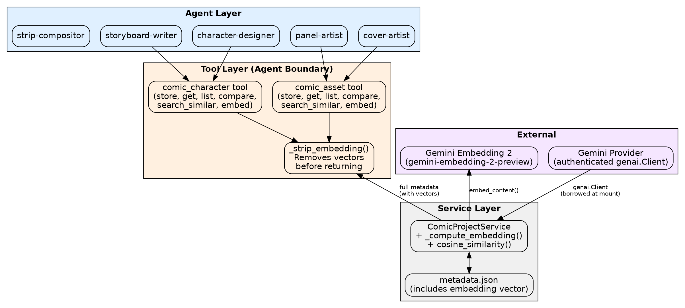
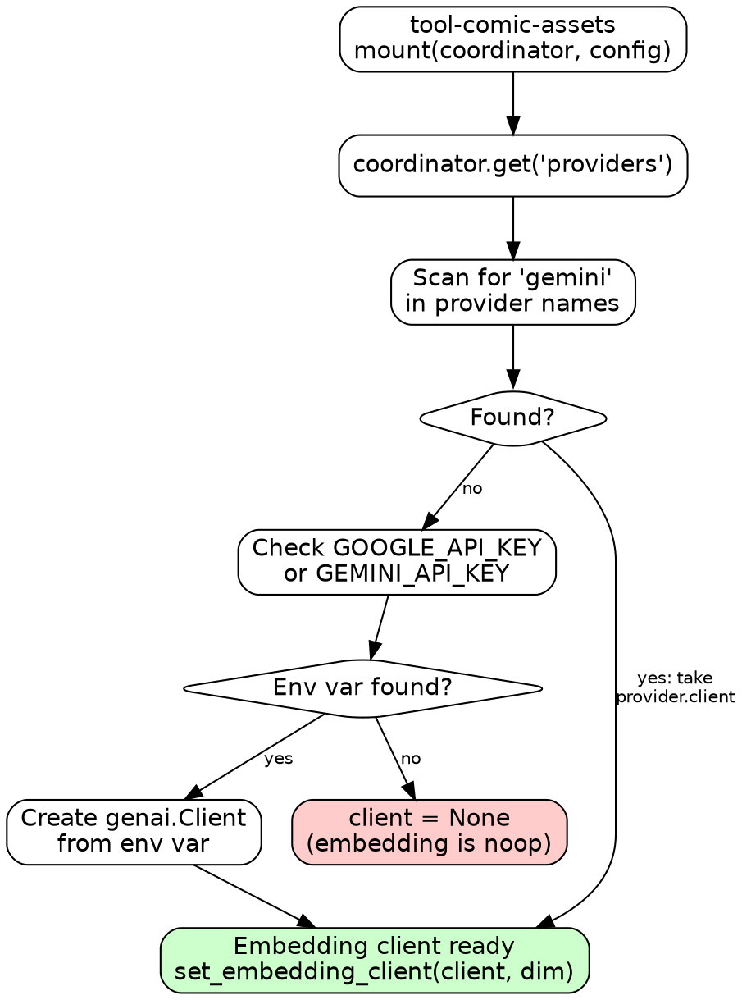
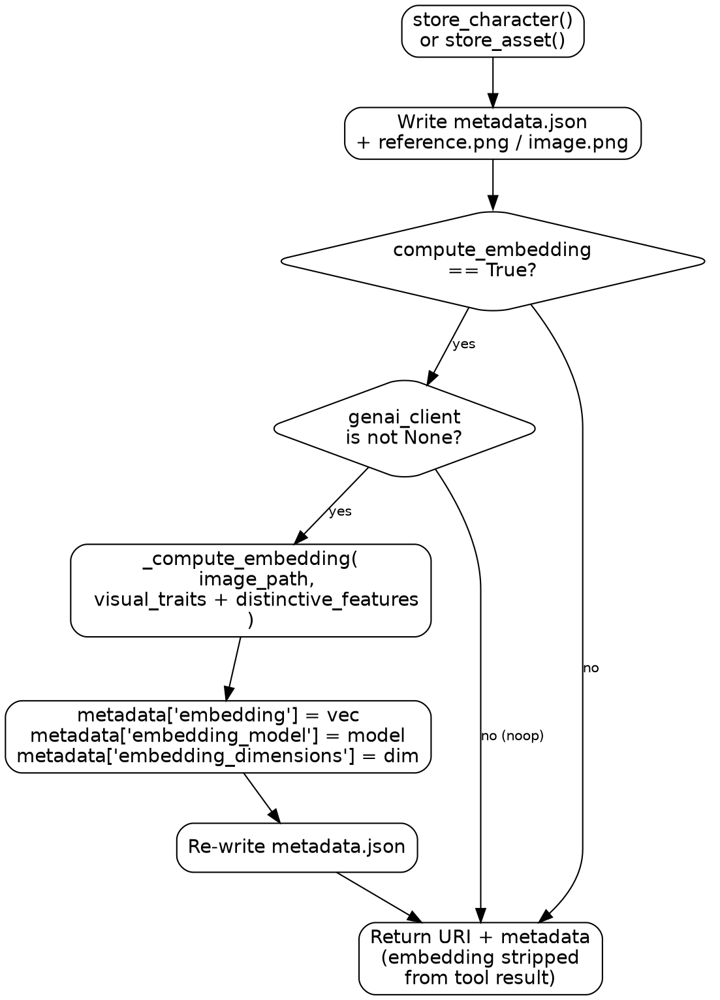
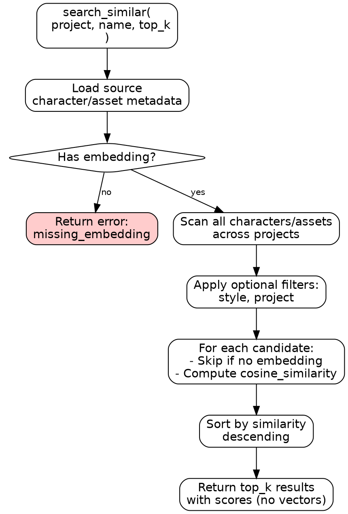
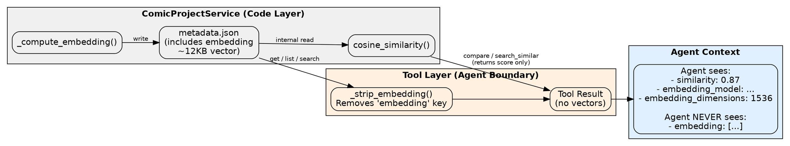
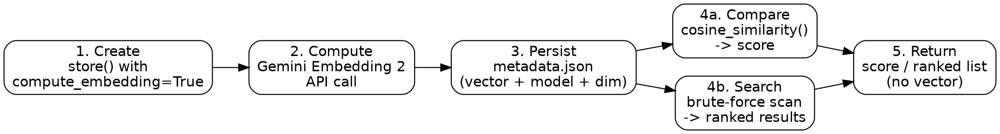
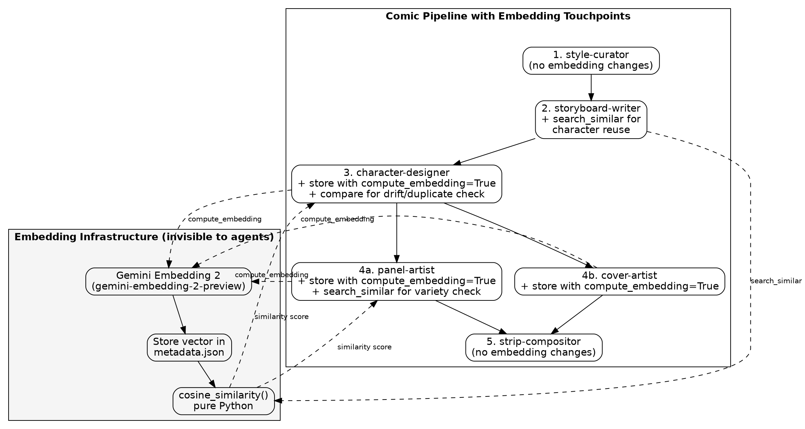

# Gemini Embedding 2 Integration Design

## Goal

Add multimodal embedding support to the comic-strips pipeline using Gemini Embedding 2 (`gemini-embedding-2-preview`), enabling semantic similarity search, variety enforcement, drift detection, and cheap persistent similarity metrics for characters and assets.

## Background

The comic pipeline currently has no way to quantify visual similarity between characters or panels. When agents need to check whether a new character looks too similar to an existing one, or whether panel compositions are becoming repetitive, they rely on expensive LLM vision calls -- or worse, they can't check at all.

Gemini Embedding 2 offers a unique multimodal embedding capability: interleaved image + text input produces a single dense vector that captures both visual and semantic information. At ~$0.00012 per embedding, this is essentially free compared to vision API calls, and the vectors persist in metadata for instant reuse.

This enables four concrete capabilities:
- **Semantic similarity search** for characters and assets across projects
- **Variety enforcement** -- ensuring new panels/characters are visually distinct
- **Drift detection** -- ensuring character redesigns retain core visual identity
- **Cross-project discovery** -- finding reusable characters from other projects

## Approach

Extend the existing `ComicProjectService` in `service.py` within `tool-comic-assets` rather than creating a separate module. Embeddings are a natural extension of asset metadata, not a separate concern. This keeps the tool surface area minimal -- same tools, one new parameter (`compute_embedding`), and three new actions (`compare`, `search_similar`, `embed`).

The embedding layer is a thin, optional addition. When no Gemini provider or API key is discoverable, all embedding features are a complete noop -- the pipeline works identically to today.

## Architecture

The embedding capability sits between the existing tool layer and the Gemini API, accessed through the same provider pattern already used by `tool-comic-image-gen`:



## Components

### 1. Embedding Client Discovery

During `mount()` in `tool-comic-assets`, the embedding client is discovered by borrowing the authenticated `genai.Client` from the Gemini provider -- the exact same pattern used by `tool-comic-image-gen`.

**Discovery order:**

1. `coordinator.get("providers")` -- scan for `"gemini"` in provider name keys, take `provider.client`
2. Fallback: `GOOGLE_API_KEY` or `GEMINI_API_KEY` environment variables (standalone mode)
3. If nothing found: `client = None` -- all embedding features become noops

**Configuration:**

```yaml
config:
  asset_embedding_dimension: 1536  # default, overridable per project
```

Default of 1536 is backed by MTEB benchmarks: 1536 (score 68.17) is slightly better than 2048 (68.16) at half the storage of 3072.



### 2. Embedding Computation

The core embedding method on `ComicProjectService`. Accepts interleaved image + text input and returns a raw float vector.

```python
async def _compute_embedding(self, image_path: str | None, text: str | None) -> list[float] | None:
    if self._genai_client is None:
        return None
    parts = []
    if image_path:
        with open(image_path, "rb") as f:
            parts.append(types.Part.from_bytes(data=f.read(), mime_type="image/png"))
    if text:
        parts.append(types.Part.from_text(text))
    if not parts:
        return None
    result = await self._genai_client.aio.models.embed_content(
        model="gemini-embedding-2-preview",
        contents=parts,
        config=types.EmbedContentConfig(
            output_dimensionality=self._embedding_dim,
            task_type="SEMANTIC_SIMILARITY",
        ),
    )
    return list(result.embeddings[0].values)
```

**Key decisions:**

| Decision | Rationale |
|----------|-----------|
| Raw vectors, no normalization | Cosine similarity handles normalization at comparison time |
| `SEMANTIC_SIMILARITY` task type | Optimized for our use case (comparing visual/conceptual similarity) |
| Interleaved image + text | Leverages Gemini Embedding 2's unique multimodal capability |
| Model: `gemini-embedding-2-preview` | Only model supporting multimodal embedding input |
| ~$0.00012 per embedding | Essentially free at comic pipeline scale |

### 3. Store Integration (`compute_embedding` Parameter)

A new optional boolean parameter on `comic_character(action='store')` and `comic_asset(action='store')`. Default `False`.

**For characters**, the interleaved input is:
- **Image**: the reference sheet PNG just stored
- **Text**: `f"{visual_traits}. {distinctive_features}. {personality}"`

**For assets** (panels, covers), the interleaved input is:
- **Image**: the panel/cover image just stored
- **Text**: the prompt or scene description from the storyboard (passed via metadata)

When embedding succeeds, three fields are added to `metadata.json`:
- `embedding` -- the raw float vector (list of 1536 floats)
- `embedding_model` -- `"gemini-embedding-2-preview"` (for staleness detection)
- `embedding_dimensions` -- the configured dimension (for mismatch detection)



**Noop guarantee**: If `self._genai_client is None`, the if-block is never entered. The store completes exactly as today. No code path changes for the non-embedding case.

### 4. `compare` Action -- Cosine Similarity Between Assets

A new action on both `comic_character` and `comic_asset` tools that returns a single similarity score.

**Interface:**

```
comic_character(action="compare", project="proj", name="hero-a", name_b="hero-b")
→ { "similarity": 0.87, "a_uri": "comic://proj/characters/hero-a", "b_uri": "comic://proj/characters/hero-b" }
```

For `comic_asset`, parameters are `uri` and `uri_b` (since assets are identified by URI).

**Implementation** -- pure Python, no numpy dependency:

```python
def cosine_similarity(a: list[float], b: list[float]) -> float:
    dot = sum(x * y for x, y in zip(a, b))
    norm_a = sum(x * x for x in a) ** 0.5
    norm_b = sum(x * x for x in b) ** 0.5
    if norm_a == 0 or norm_b == 0:
        return 0.0
    return dot / (norm_a * norm_b)
```

**Similarity score interpretation** (guidance for agents, not hardcoded gates):

| Range | Interpretation | Use case |
|-------|---------------|----------|
| > 0.90 | Near-duplicate | Flag for variety enforcement |
| 0.70 -- 0.90 | Similar | "Find me something like this" |
| < 0.70 | Distinct | Confirms sufficient variety |

**Edge cases:**

| Condition | Result |
|-----------|--------|
| Either asset has no embedding | `{"similarity": null, "reason": "missing_embedding"}` |
| Dimension mismatch | `{"similarity": null, "reason": "dimension_mismatch"}` |
| Same asset compared to itself | `{"similarity": 1.0}` |

### 5. `search_similar` Action -- Semantic Search Across Projects

Embedding-based discovery that returns a ranked list of similar characters or assets.

**Interface:**

```
comic_character(action="search_similar", project="proj", name="hero-a", top_k=5)
→ {
    "query_uri": "comic://proj/characters/hero-a",
    "results": [
      {"uri": "comic://other-proj/characters/warrior", "similarity": 0.84, "name": "Warrior", ...},
      {"uri": "comic://proj/characters/sidekick", "similarity": 0.72, "name": "Sidekick", ...},
    ]
  }
```

Same pattern for `comic_asset` -- find similar panels/covers.

**Filtering:** Optional `style` and `project` parameters narrow the search scope. Without them, searches everything -- the cross-project discovery use case.

**Performance:** Brute-force scan over stored metadata files. For tens to low hundreds of characters and a few hundred panels, each comparison is a dot product on ~1536 floats -- sub-millisecond per pair. No vector database needed. Future optimization if scale ever demands it.

**Graceful degradation:** Assets without embeddings are silently skipped. As you start embedding new assets, old ones simply don't appear in results until backfilled.



### 6. `embed` Action -- Backfill Existing Assets

For characters and assets already stored without embeddings:

```
comic_character(action="embed", project="proj", name="hero-a")
comic_asset(action="embed", project="proj", issue="issue-001", type="panel", name="panel_01")
```

Loads existing metadata and image, calls `_compute_embedding()`, writes the embedding back into `metadata.json` (plus `embedding_model` and `embedding_dimensions`). Noop if no Gemini client available.

Optional `style` parameter for characters targets a specific version. Without it, embeds the latest version.

Agents or recipes backfill a project with a simple foreach loop -- no batch API needed:

```
for each character in comic_character(action="list", project="proj"):
    comic_character(action="embed", project="proj", name=character.name)
```

### 7. Embedding Isolation -- Never Leak Vectors to Agent Context

**This is a critical design constraint.** A 1536-float vector is ~12KB of JSON. Embedding vectors must NEVER appear in tool results returned to agents.

**Rule:** All tool actions that return metadata must strip the `embedding` key before returning.

Applies to every action that surfaces metadata on both tools: `get`, `list`, `list_versions`, `search`, `search_similar`.

Stripping happens at the **tool layer** (in `execute()`), not the service layer. The service always has full access for internal computation.

```python
def _strip_embedding(metadata: dict) -> dict:
    return {k: v for k, v in metadata.items() if k not in ("embedding",)}
```

We **keep** `embedding_model` and `embedding_dimensions` in returned metadata -- small strings/ints that tell agents "this asset has an embedding" without including the vector itself. Useful for agents to know whether `compare` or `search_similar` will work on a given asset.

**What agents see:**

```json
{
  "name": "Hero",
  "visual_traits": "angular face, red cape...",
  "embedding_model": "gemini-embedding-2-preview",
  "embedding_dimensions": 1536
}
```

**What agents never see:**

```json
{
  "embedding": [0.0234, -0.0891, 0.1456, "... 1536 floats ..."]
}
```

The `compare` and `search_similar` actions return **scores** (single floats), not vectors.



## Data Flow

### Embedding Lifecycle

An embedding is created once during asset storage, persisted in `metadata.json`, and consumed only by code-level comparison functions. It never transits the tool-agent boundary.



### Storage Schema

Embeddings are stored inline in the existing `metadata.json` alongside other metadata fields:

```json
{
  "name": "Hero",
  "style": "manga",
  "visual_traits": "angular face, red cape, silver armor",
  "distinctive_features": "scar over left eye, glowing sword",
  "personality": "stoic but compassionate",
  "embedding": [0.0234, -0.0891, 0.1456, "... 1536 floats total ..."],
  "embedding_model": "gemini-embedding-2-preview",
  "embedding_dimensions": 1536
}
```

No schema migration needed -- the new fields are additive. Existing assets without embeddings continue to work exactly as before.

## Pipeline Integration

The embedding layer integrates into the existing comic pipeline at specific touchpoints. Most pipeline stages are unaffected.



### Agent-Specific Integration

**storyboard-writer** (character reuse):
- Today: calls `comic_character(action='list')` and matches by name/style
- New: calls `search_similar` to find visually similar characters across projects. Gets back names, URIs, and similarity scores. Decides whether to reuse based on score.

**character-designer** (duplicate prevention + drift detection):
- After generating and storing with `compute_embedding=True`, calls `compare` between old and new versions
- Similarity > 0.95: near-duplicate -- regenerate with more variety
- Similarity < 0.5 on redesign: drifted too far -- regenerate closer to original
- These thresholds are agent-level judgment, not hardcoded gates

**panel-artist** (variety enforcement):
- After storing a panel with `compute_embedding=True`, calls `search_similar` against other panels in the same issue
- Similarity > 0.92: compositions too repetitive -- adjust framing/angle

**strip-compositor**: No changes needed. Assembles final HTML from URIs as today.

## Error Handling

| Scenario | Behavior |
|----------|----------|
| No Gemini provider/key discoverable | Complete noop -- `compute_embedding=True` silently ignored |
| Gemini API call fails | Embedding field not written; store succeeds (embedding is best-effort) |
| `compare` with missing embedding | Returns `{"similarity": null, "reason": "missing_embedding"}` |
| `compare` with dimension mismatch | Returns `{"similarity": null, "reason": "dimension_mismatch"}` |
| `search_similar` source has no embedding | Returns error with `"reason": "missing_embedding"` |
| `search_similar` candidate has no embedding | Candidate silently skipped |
| `embed` backfill with no client | Noop -- returns success with no changes |

The guiding principle: **embedding features never break the existing pipeline**. They degrade gracefully to noops or partial results.

## Testing Strategy

### Unit Tests

- **Noop behavior**: Verify that `compute_embedding=True` with `client=None` produces identical results to `compute_embedding=False` -- no embedding fields in metadata, no errors
- **Embedding stripping**: Verify `_strip_embedding()` removes `embedding` but keeps `embedding_model` and `embedding_dimensions`
- **Cosine similarity**: Test with known vectors (orthogonal → 0.0, identical → 1.0, opposite → -1.0)
- **Edge cases in compare**: Missing embeddings, dimension mismatch, self-comparison

### Integration Tests

- **Store + retrieve roundtrip**: Store a character with `compute_embedding=True`, verify embedding exists in metadata.json on disk, verify it's stripped in tool result
- **Compare flow**: Store two characters with embeddings, call compare, verify score is a float in [-1.0, 1.0]
- **Search similar flow**: Store multiple characters, call search_similar, verify results are sorted by descending similarity
- **Backfill flow**: Store a character without embedding, call embed, verify embedding is added

### Mock Strategy

- Mock `genai.Client.aio.models.embed_content()` to return deterministic vectors in tests
- No real API calls in CI -- the mock returns predictable 1536-float vectors for assertion

## Technical Summary

| Property | Value |
|----------|-------|
| Model | `gemini-embedding-2-preview` |
| SDK | `google-genai` (`client.aio.models.embed_content()`) |
| Default dimensions | 1536 (configurable via `asset_embedding_dimension`) |
| Storage | Raw float list in `metadata["embedding"]` (~12KB at 1536 dims) |
| Comparison | Pure Python cosine similarity (no numpy dependency) |
| Input | Interleaved image + text (multimodal) |
| Noop behavior | Complete noop when no Gemini provider/key available |
| Embedding isolation | Vectors stripped at tool layer, never reach agent context |
| Cost | ~$0.00012 per image embedding |
| MTEB score at 1536 dim | 68.17 (same as 2048, better than 768) |

## Open Questions

1. Should we add a `recompute_embeddings` recipe that backfills all existing assets in a project?
2. Should the similarity thresholds (0.95 for duplicate, 0.5 for drift) be configurable per project or kept as agent-level guidance?
3. Do we want to embed style guides too (for cross-project style discovery)?
